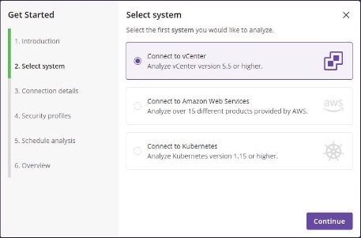
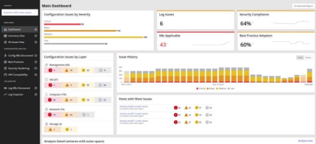



**Runecast Analyzer User Guide** 

**V4.7** 

Copyright © 2014-2021 Runecast Solutions Ltd. All rights reserved. 

Contents 

1  [Installation and Setup ................................................................................................................................... 6](#_page5_x91.00_y128.00)
1. [System Requirements ................................................................................................................................. 6](#_page5_x69.00_y161.00)
1. [Deployment .............................................................................................................................................. 13](#_page12_x69.00_y405.00)
1. [Initial Configuration .................................................................................................................................. 14](#_page13_x69.00_y128.00)
1. [Connect to a System and Analyze ..................................................................................................... 14](#_page13_x69.00_y240.00)
1. [Licensing Runecast Analyzer .............................................................................................................. 28](#_page27_x69.00_y493.00)
1. [Configure Log Collection .................................................................................................................... 30](#_page29_x69.00_y439.00)
2  [Working with Runecast Analyzer ................................................................................................................ 34](#_page33_x69.00_y128.00)
1. [What is an Issue? ...................................................................................................................................... 34](#_page33_x69.00_y161.00)
1. [What is an Object? .................................................................................................................................... 36](#_page35_x69.00_y506.00)
1. [Context ..................................................................................................................................................... 36](#_page35_x69.00_y580.00)
1. [MAIN MENU ............................................................................................................................................. 37](#_page36_x69.00_y128.00)
1. [Dashboard ......................................................................................................................................... 37](#_page36_x69.00_y173.00)
1. [Inventory View................................................................................................................................... 41](#_page40_x69.00_y644.00)
1. [All Issues View ................................................................................................................................... 42](#_page41_x69.00_y424.00)
5. [CONFIGURATION ANALYSIS ...................................................................................................................... 46](#_page45_x69.00_y128.00)
1. [Config KBs Discovered ....................................................................................................................... 46](#_page45_x69.00_y217.00)
1. [Best Practices ..................................................................................................................................... 46](#_page45_x69.00_y274.00)
1. [Security Compliance .......................................................................................................................... 46](#_page45_x69.00_y375.00)
1. [HW Compatibility .............................................................................................................................. 54](#_page53_x69.00_y264.00)
1. [Custom Profiles .................................................................................................................................. 61](#_page60_x69.00_y514.00)
6. [LOG ANALYSIS ........................................................................................................................................... 62](#_page61_x69.00_y597.00)
1. [Log KBs Discovered ............................................................................................................................ 63](#_page62_x69.00_y128.00)
1. [Log Inspector ..................................................................................................................................... 63](#_page62_x69.00_y237.00)
**PAGE4 |** P a g e ****

Runecast Analyzer User Guide v4.7.5 

7. [Definition Database .................................................................................................................................. 63](#_page62_x69.00_y534.00)
7. [EC Dashboard ............................................................................................................................................ 63](#_page62_x69.00_y608.00)
7. [Settings Page............................................................................................................................................. 65](#_page64_x69.00_y310.00)
1. [Connections ....................................................................................................................................... 65](#_page64_x69.00_y385.00)
1. [Automatic Scheduler ......................................................................................................................... 65](#_page64_x69.00_y515.00)
1. [Alerting .............................................................................................................................................. 65](#_page64_x69.00_y587.00)
1. [Log Analysis ....................................................................................................................................... 66](#_page65_x69.00_y128.00)
1. [Knowledge Profiles ............................................................................................................................ 66](#_page65_x69.00_y280.00)
1. [User Profile ........................................................................................................................................ 66](#_page65_x69.00_y420.00)
1. [Filters ................................................................................................................................................. 67](#_page66_x69.00_y495.00)
1. [Licenses .............................................................................................................................................. 71](#_page70_x69.00_y233.00)
1. [Update ............................................................................................................................................... 71](#_page70_x69.00_y313.00)
1. [API Access tokens ............................................................................................................................ 72](#_page71_x69.00_y343.00)
1. [Enterprise Console ........................................................................................................................... 72](#_page71_x69.00_y528.00)
10. [Tool Tips .................................................................................................................................................. 72](#_page71_x69.00_y608.00)
11. [About Runecast Analyzer ........................................................................................................................ 73](#_page72_x69.00_y128.00)
3  [Runecast Console Interface ........................................................................................................................ 74](#_page73_x69.00_y128.00)
4  [Advanced Configuration ............................................................................................................................. 75](#_page74_x69.00_y128.00)
1. [How to change the rcadmin password ..................................................................................................... 75](#_page74_x69.00_y228.00)
1. [How to replace the self-signed SSL certificate.......................................................................................... 75](#_page74_x69.00_y339.00)
1. [How to configure a Proxy Server .............................................................................................................. 77](#_page76_x69.00_y128.00)
1. [How to disable the session timeout for the web interface of Runecast Analyzer ................................... 78](#_page77_x69.00_y128.00)
1. [How to change Runecast Analyzer network configuration ...................................................................... 78](#_page77_x69.00_y443.00)
1. [How to change address of Knowledge updates repository ...................................................................... 79](#_page78_x69.00_y165.00)
1. [How to enforce support of TLSv1.2 protocol............................................................................................ 80](#_page79_x69.00_y128.00)
1. [How to configure remote audit logging .................................................................................................... 80](#_page79_x69.00_y478.00)

**4 [|** P a g e** ](#_page79_x69.00_y478.00)**
Runecast Analyzer User Guide v4.7.5 

9. [How to extend the disks ........................................................................................................................... 81](#_page80_x69.00_y203.00)
9. [How to uninstall the Runecast Analyzer Plug-in ..................................................................................... 81](#_page80_x69.00_y360.00)
5  [Runecast vSphere Web Client Plug-in ........................................................................................................ 85](#_page84_x69.00_y128.00)
1. [Registering the plug-in with vCenter server ............................................................................................. 85](#_page84_x69.00_y274.00)
1. [Plug-in Configuration ................................................................................................................................ 85](#_page84_x69.00_y445.00)
1. [Working with the Runecast Plug-in .......................................................................................................... 85](#_page84_x69.00_y542.00)
1. [Unregistering the extension from vCenter Server and cleaning up its files ............................................. 86](#_page85_x69.00_y128.00)

1  Installation and Setup 

1. System Requirements 

The following section details the capacity and configuration requirements for deployment of the pre- packaged Runecast Analyzer appliance: 

- VMware vSphere infrastructure should already be deployed. ESXi hosts must be v6.x and above, and these must be managed by vCenter v6.x or v7.x. 
- NSX-V is supported by connecting to an NSX-V Manager when paired with a vCenter instance. Runecast Analyzer supports NSX-V Manager v6.2 and above. 
- VMware NSX-T Data Center is supported by connecting to an NSX-T Manager or Cluster Virtual IP. Runecast Analyzer supports NSX-T Manager version 2.4 and above. 
- VMware Cloud Director is supported by connecting to the provider portal. Runecast Analyzer supports VMware Cloud Director version 10.0 and above. 
- VMware Horizon is supported by connecting to a Connection Server. For Connection Servers that are part of a single replication group, it is required to establish the connection to only one Connection Server which belong to the group. Also, if there is a Load Balancer configured with **session persistence**, it can be used to connect to a Connection Server in a replication group. Runecast Analyzer supports Horizon v6.x and above. 
- Amazon Web Services is supported by connecting to an AWS Account. 
- Kubernetes is supported by connecting to API server address using service account token authentication. Runecast Analyzer follows an extended version of the Kubernetes lifecycle policy, testing and validating against the current Kubernetes release, as well as the three previous releases. Managed Kubernetes environments, including Amazon EKS, Microsoft AKS, Google GKE and HPE Ezmeral Container Platform are supported. However, as these services do not expose their control plane to the end customer, Runecast Analyzer cannot provide results for the control plane (as such, results in these environments are for the customer deployed clusters only). 
- HW Compatibility checks are performed on ESXi v6.0 and above.  
- The Runecast Analyzer appliance is normally deployed into an existing vSphere infrastructure. Appropriate resource allocation for the appliance is selected during the deployment process. The standard sizing options are small/medium/large with resources allocated as follows: 
- Small (use this configuration for small environments: up to 50 Hosts) 
  - 2 vCPU 
  - 4 GB RAM 
  - 120GB Storage 
  - 100Mbit network (1GBit or above recommended) 
- Medium (use this configuration for medium environments: up to 150 Hosts) 
- 4 vCPU 
- 8 GB RAM 
- 120GB Storage 
- 100Mbit network (1GBit or above recommended) 
- Large (use this configuration for large environments: up to 1200 Hosts) 
- 8 vCPU 
- 32 GB RAM 
- 120GB Storage 
- 100Mbit network (1GBit or above recommended) 
- A user with the following privilege **at vCenter level** is needed: **Minimum required:** 
- Read Only 

**[Note]** The minimum required permission for the Analyzer to perform scanning is **Read Only.** However, in this case collection will not be fully comprehensive and it will not be possible to report issues related to some areas of the configuration (such as device-specific info from ESXi hosts (driver, firmware)).  

In order to provide a fully comprehensive analysis, the additional privileges provided below will ensure that sufficient information is collected for 100% of the checks performed by Runecast Analyzer: 

**Required for CIM collection:** 

- Host > CIM > CIM interaction 

**Required for VSAN configuration collection:** 

- Global > Settings 

**Required for files collection:** 

- Host > Configuration > Firmware 

**Required for Kernel modules collection:** 

- Host > Configuration > Change settings 

**Required for auto ESXi syslog configuration:** 

- Host > Configuration > Advanced settings 
- Host > Configuration > Change settings 
- Host > Configuration > Security profile and firewall **Required for auto VM syslog configuration:** 
- Virtual Machine > Configuration > Advanced 

**Required for auto Web Client registration:** 

- Extension > Register extension 
- Extension > Update extension **Required for auto Host Profile collection:** 
- Host profile > View 
- Host profile > Edit 

**Required for HW Compatibility:** 

- Host > Configuration > Change settings 
- Global > Settings 

**[Note]** A PowerCLI script to automatically create Runecast Role with above permissions, is available at [https://github.com/Runecast/public/blob/master/PowerCLI/createRunecastRole.ps1 ](https://github.com/Runecast/public/blob/master/PowerCLI/createRunecastRole.ps1)

- For connection to NSX-V a user with the following privileges in NSX Manager is needed: **Minimum requirement:** 
- Auditor 

**Recommended**: 

- Security administrator – required to leverage the NSX-V Custom Dashboard Widget for Runecast. 

**[Note]** Due to constraints in NSX-V Manager prior to v6.3.3 Runecast Analyzer is unable to automatically validate that an NSX-V Manager is registered to a specific vCenter. You will be asked to provide confirmation during the connection process. 

**Authentication source:** 

- **Loca**l - local CLI user can be created following the below procedure: 
1. Open console session to NSX-V Manager and log in with the Administrator account 
1. Switch to Privilege mode using the *“enable”* command 
1. Switch to Configuration mode using the *“configure terminal”* command 
1. Add a CLI user account using the *“user <username> password (hash | plaintext)* 

*<password>”* command 

Example: *user cliuser password plaintext abcd1234* 

5. Save the configuration with *“write memory”* command 
6. Allow the created CLI user to run the REST API calls using the “*user <username> privilege* 

*web-interface”* command 

7. Issue POST request to  

*“https://<NSX-IP>/api/2.0/services/usermgmt/role/<username>?isCli=true”* endpoint with user having administrator privileges to assign a role to the newly created CLI user. Example of the body content assigning *“auditor”* privilege: 

*<accessControlEntry>* 

*<role>auditor</role>* 

*<resource>* 

*<resourceId>globalroot-0</resourceId>* 

*</resource>* 

*</accessControlEntry>* 

8. Now you'll be able to use the new CLI user for connection to NSX-V Manager 
- **Domain** - domain users are supported on NSX-V 6.4 and later**  
- For connection to NSX-T a user with the following privileges in NSX-T Manager is needed: **Minimum requirement:** 
- Auditor 
- For connection to a Connection Server a user with the following privileges in Horizon is needed: **Recommended**: 
- Administrators (Read only). 
- For connection to VMware Cloud Director a user with the following privileges on the vCD provider level is needed: 

**Minimum requirement:** 

- A role with View only permissions. 
- For connection to an AWS Account, a user with the following privileges is needed: **Recommended**: 
- We recommend using an account with Programmatic access only. To limit the operational overhead, we suggest using the AWS managed ReadOnlyAccess policy. This will cover future functionality and analysis capability provided by Analyzer, without the need to adjust the policy very often. 
- For connection to a Kubernetes cluster a service account token is required. The service account with the following privileges is needed: 

**Recommended:** 

- verbs: 
  - get 
  - list 
  - watch 
- resources: 
- namespaces 
- pods 
- replicationcontrollers 
- serviceaccounts 
- services 
- daemonsets.apps 
- deployments.apps 
- replicasets.apps 
- statefulsets.apps 
- cronjobs.batch 
- jobs.batch 
- networkpolicies.networking.k8s.io 
- podsecuritypolicies.policy 
- clusterrolebindings.rbac.authorization.k8s.io 
- clusterroles.rbac.authorization.k8s.io 
- rolebindings.rbac.authorization.k8s.io 
- roles.rbac.authorization.k8s.io 

You can use the following commands to create a service account and output the account token: 

- set the namespace where the service account will be created *export NAMESPACE="kube-system"* 
- create the service account 

*kubectl create serviceaccount runecast-analyzer -n ${NAMESPACE}* 

- create clusterrole 

*kubectl create clusterrole runecast-analyzer --verb=get,list,watch -- resource=namespaces,pods,replicationcontrollers,serviceaccounts,services,daemonsets.apps,deplo yments.apps,replicasets.apps,statefulsets.apps,cronjobs.batch,jobs.batch,networkpolicies.netwo rking.k8s.io,podsecuritypolicies.policy,clusterrolebindings.rbac.authorization.k8s.io,clusterr oles.rbac.authorization.k8s.io,rolebindings.rbac.authorization.k8s.io,roles.rbac.authorization .k8s.io* 

- bind the clusterrole 

*kubectl create clusterrolebinding runecast-analyzer --clusterrole=runecast-analyzer -- serviceaccount=${NAMESPACE}:runecast-analyzer* 

- output the service account token 

*kubectl get serviceaccounts runecast-analyzer -n ${NAMESPACE} -o jsonpath='{.secrets[].name}' | xargs kubectl get secret -n ${NAMESPACE} -o jsonpath='{.data.token}' | base64 -d | awk '{print "copy the service account token:\n"$1"\n"}'* 

- Required ports: 

|Source |Destination |Protocol |Port |Description |Comment |
| - | - | - | - | - | - |
|RCA |vCenter |TCP |443 |Collection of data using vSphere SDK (vCenter, ESXi, VMs configuration settings) |required for core product functionality |
|RCA |ESXi |TCP |443 |Collection of data from ESXi servers (file-level configuration settings) |needed for file-level checks |
|RCA |ESXi |TCP |5988, 5989 |CIM data collection from ESXi servers  |needed for CIM data  |
|RCA |NSX Manager |TCP |443 |Collection of data using NSX-v REST API (NSX configuration settings) |required for core product functionality (in case NSX-v functionality is required) |
|RCA |NSX-T Manager |TCP |443 |Collection of data using NSX-T REST API (NSX-T configuration settings) |required for core product functionality (in case NSX-T functionality is required) |

|RCA |AWS |TCP |443 |Collection of data using AWS REST API (AWS configuration settings) |required for core product functionality (where AWS functionality is required) |
| - | - | - | - | :- | :- |
|RCA |Horizon |TCP |443 |Collection of data using Horizon API (Horizon configuration settings) |required for core product functionality (in case Horizon functionality is required) |
|RCA |Kubernetes API |TCP |6443 |Collection of data using Kubernetes API (Kubernetes configuration settings) |required for core product functionality (in case Kubernetes functionality is required) |
|RCA |Cloud Director |TCP |443 |Collection of configuration data using vCD API |required for core product functionality (in case vCD functionality is required) |
|ESXi |RCA |UDP |514 |Syslog data collection |needed for log analysis |
|RCA |updates.runecast.com |TCP |443 |Application and rules definition updates |needed for online updates only |
|User browser |RCA |TCP |80, 443 |RCA web interface |HTTP always redirects to HTTPS |
|vSphere Web Client |RCA |TCP |443 |Web client plugin communication to RCA |needed for displaying results in WebClient |
|REST API client |RCA |TCP |443 |Runecast API client’s communication |needed for REST API |
|Enterprise Console (EC) |RCA |TCP |443 |Single pane of Glass to RCA communication |needed for displaying results from multiple analyzers |
|RCA |DC |TCP |88 |RCA communication to DC |needed for Kerberos authentication |
|RCA |LDAP |TCP |389 |RCA communication to AD |needed for connection to a DC on a regular LDAP port |

|RCA |LDAP SSL |TCP |636 |RCA communication to AD |needed for connection to a DC on a protected LDAPS port |
| - | - | - | - | - | - |
|RCA |DNS |TCP |53 |RCA communication to DNS |required for core product functionality |

- Internet Connectivity: Runecast Analyzer is packaged as a virtual appliance in OVA format that is deployed into your virtual infrastructure. All data and logic necessary for full operation is contained in the appliance. No data is transmitted from the Runecast Analyzer outside of your data center. Optionally, the Runecast Analyzer can be connected to the Internet to download zero-touch updates for knowledge definitions and application updates. A fully off-line update mechanism is provided using files (.ISO and .bin) made available from the user portal. 
- Supported browsers to access the Runecast Analyzer Web Interface: Chrome v68.0.3440.106 and newer, Firefox v50.0.2 and newer, MS Edge v38.14393.0.0 and newer. 
2. Deployment 
1. Download the Runecast Analyzer **OVA file** from your Runecast web portal https://portal.runecast.com/login, and deploy from your download location. 
1. **Accept** the license agreement. 
1. Select the **VM name** **and** **folder**, select the destination **host**, **datastore** and **network** on your environment. 
1. In **Customize template**, configure the **network configuration** for the Runecast Analyzer appliance. 
1. Review the settings and click **Finish**. 
1. Power on the appliance. After the boot process has finished, you should see the appliance console displaying the URL to the application and how to access the **Runecast Console Interface**. 
1. If you need to change the settings of the appliance itself (network configuration, update settings), you can login to the **Console Interface** of the Runecast appliance (**default user**: rcadmin  / **password**: admin) 
3. Initial Configuration 

This section describes the initial configuration steps for the Runecast appliance including connections to systems like vSphere environment and NSX-V Manager (if available), Amazon Web Services, Kubernetes, NSX- T Manager, VMware Cloud Director, Horizon Connection Server but also configuration of Web Client Plug-in, licensing, log forwarding, and performing an initial analysis. 

1. Connect to a System and Analyze 
1. From a[ browser,](#_page12_x69.00_y357.00) navigate to the Runecast Analyzer Web Interface url: https://*applianceIP* and login with default credentials:  

**user:** rcuser  **password:** Runecast! 

**[Note]** Runecast Analyzer is available also as an AMI, available on the AWS Marketplace. Once the instance was configured and launched, navigate to the Runecast Analyzer Web Interface url https://*InstancePublicIP* and login with default credentials:  

**user:** rcuser  

**password:** *your EC2 Instance ID* 

2. During the first login no system connections will exist so you will be prompted to configure a connection to your first system. Select the type of the system you want to add (see[` `**System requirements** ](#_page5_x69.00_y161.00)section above for required privileges) and **Continue** to the next step. 

- If your selection is the vCenter server, provide the required connection information and click **Continue** to the next step. 

If your selection is AWS, provide the required connection information and click **Continue** 

If your selection is Kubernetes, provide the required connection information and click **Continue** 

- After the successful validation of the connection, you can select one or more security profiles relevant to your organization. Once it is done, **Continue** to the next step. 

- Automatic scan scheduling can be configured during this step. We encourage you to schedule them to benefit from continuous reporting. Once automatic scanning is selected, the scanning frequency can be chosen. Press **Continue** to move forward to the final step. 

- An overview of your configurations is displayed in this page. Press Analyze now to trigger your first analysis. 

Optionally, you can help to improve Runecast Analyzer by sending limited anonymous usage data.  

The telemetry data contains the following information: 

- Version of Runecast Analyzer. 
- Number of Systems (NOT their IP or name). 
- Issues discovered and their severity (NOT the objects affected). 
- % of best practice adoption and security compliance (NOT the objects affected). 
- Preferences in settings like activation of Security Profiles, Automatic Scheduler and the total number of CPUs (NOT the objects affected). 
- User actions like display dashboard, display settings, add System, remove System and start the analysis (NOT the objects affected). 
- Hardware details like manufacturer, description, disks, bios/firmware/driver versions (NOT their IP or hostname). 
- Browser used and version. 

**[Note]** You always have the option to change your preference from the **User profile** tab under **Settings**. Once a license has been applied, the data collection will turn off automatically. If you would like to continue sending information to improve Runecast Analyzer, you can turn it on from **User profile** under **Settings**.  

3. To connect additional **Systems**, navigate to **Settings** and select **Connections** tab. Click **Add vCenter** button and follow these steps:  
- Enter the vCenter connection information and click **Continue** to the next step.  

- Validate the successful connection to vCenter.  During validation, an attempt to automatically detect NSX-V will be in process. If no NSX-V Manager is detected, this step will be skipped. If a NSX-V manager is detected, then the connection settings will be shown. Enter the username and password of an account with at least auditor permissions to add NSX-V to Runecast and benefit from the same functionality Runecast Analyzer offers for vSphere. If you skip setting up the NSX-V connection at this point it can be established later.  
- Click **Continue** to proceed to the last step. 

- The last step will summarize the actions to be performed by Runecast Analyzer after clicking the **Finish** button. 

Once you have added one or more vCenters (and optionally, NSX-V Managers) an overview of all connections will be presented including the status of NSX-V and also the Web Client Plug-in installation status: 

- The NSX-V column will display one of these states: 
- **Not present:** if no NSX-V was found to be connected to vCenter server. 
- **Discovered:** if NSX-V was discovered but it was not added to Runecast Analyzer. 
- If **NSX-V** has been added it will be marked with the symbol . 
- The Web client plugin column will display one of the states: 
- **Not installed** 
- **Installed** 

Additional operations for Web Client Plug-in can be triggered from the **Actions** button. For more detail about the plug-in please read the section[ Registering the Plug-in with vCenter ](#_page84_x69.00_y274.00)server. 

Both vCenter and NSX-V can be reconfigured by using the  button, made available on hover.  Multiple actions can be performed from the dropdown **Actions** button located on the right side. 

4. To connect to Horizon Connection Server (or Load Balancer) click “**Add Horizon”** button and follow these steps: 
- Provide the Horizon information and click **Continue** to the next step.  

- Under the **Related vCenters** tab of the Horizon connection are listed all vCenter Servers which are configured for the particular Horizon environment. For complete and more relevant results it is recommended to add all Horizon vCenter Servers to Runecast Analyzer. The vCenters marked with a checkbox are already connected to Runecast Analyzer. The ones which are missing have an **Add vCenter** link that will open the interactive dialog to add the vCenter to Runecast Analyzer. 

**[Note]** It is not possible to compare the vCenter Servers UUID prior to Horizon v7.4. If you're using Horizon v7.4 or older, please ensure you add the vCenter Servers in Runecast with the same name as added in Horizon.  

5. To connect to Amazon Web Services, click the “**Add AWS”** button and follow these steps: 
- Provide the AWS access key credentials and click **Continue** to the next step.  

- After confirmation was received in Step 2, you will be able to see the listed AWS accounts you have logged into: 

6. To connect to a Kubernetes cluster, click **“Add Kubernetes”** button and follow these steps: 
- Provide the Kubernetes cluster API address, port and service account token and click **Continue** to the next step.  

- After confirmation was received in Step 2, you will be presented with a list of Kubernetes clusters that you have connected: 

Multiple actions can be performed from the dropdown **Actions** button located on the right side. 

7. To connect to a VMware NSX-T Data Center, click the “**Add NSX-T”** button and follow these steps: 
- Provide the NSX-T information and click Continue to the next step. 

- The second step will summarize the actions to be performed by Runecast Analyzer after clicking the Finish button. 

- After confirmation was received in Step 2, you will be presented with a list of NSX-T environments that you have connected. 

Multiple actions can be performed from the dropdown **Actions** button located on the right side. 

8. To connect to VMware Cloud Director, click the "Add VMware Cloud Director" button and follow these steps: 
- Provide the vCD information and click Continue to the next step. 

- The second step will summarize the actions to be performed by Runecast Analyzer after clicking the Finish button. 

- After confirmation was received in Step 2, you will be presented with a list of vCD instances that you have connected. 

Multiple actions can be performed from the dropdown Actions button located on the right side. 

9. Click the **Analyze Now** button on the top navigation bar to perform an initial analysis. 
10. If only one System is configured it will be scanned. If multiple Systems (vCenters, Horizon Connection Servers or AWS Accounts) are connected you can choose which Systems to analyze. You can select them all or choose specific ones. 

11. After the analysis process has completed (the time taken can vary depending on number of Systems selected to be scanned and the size of environments) you can navigate to the dashboard and various views to see the results. 
2. Licensing Runecast Analyzer 

Runecast Analyzer is licensed based on the number of CPU sockets in your environment. It comes with a 14 day evaluation period without needing to add a license. During the trial evaluation period full functionality is provided in the application, although detail is not provided for all issues. In order to add and assign a valid license to your hosts, follow the steps below. 

1. Click the **Settings** icon located on the right side of the top navigation bar. 
1. Click the **Licenses** tab. 
1. Click **Add License** to start the two-step wizard for adding and assigning a license. 
1. In Step 1 of the wizard, select a valid license file you obtained from Runecast Solutions and write a license description. Click **Add License**. 

**[Note]** This action will add the license to your Runecast appliance but will not assign it to any specific hosts. Proceed to the next step. 

5. In Step 2 of the wizard, you can select specific hosts to license. Select the hosts from the **Unlicensed hosts** column and click on **>** to move them under **Licensed hosts** on the right-hand side. If the hosts have already been licensed, they will not appear under **Unlicensed hosts**. Click **Assign License** once you are done. 

The license you specified at Step 1 of the wizard was added to your Runecast appliance and it was assigned to the host you specified in Step 2. Once added, the license appears in the licenses list: 

Click **Manage** to change the license assignment or description. You can click **Remove** to remove the license from the list and disassociate it from hosts. 

3. Configure Log Collection 

Runecast offers real-time analysis of logs received from the vSphere hosts and VMs. Your hosts may already be forwarding their logs to a standard syslog collector. Runecast can be configured as an additional syslog destination; logs will continue to be sent to your other syslog server(s) and you do not need to delete any current syslog server addresses. Runecast will retain only the relevant log entries that may indicate a potential issue. 

Configure log settings for all **ESXi hosts** and **VMs** in order to maximize the data being analyzed for issues. 

**[Note]** The log configuration can be carried out at any time. Runecast Analyzer will start analyzing the logs immediately after they are forwarded to the appliance. If you would like to setup log collection later, you can skip this step. 

 ESXi Log Forwarding – Automatic Setup 

1. Ensure that the vCenter user you have configured has the following privileges: 
- Host > Configuration > Advanced settings 
- Host > Configuration > Network configuration 
2. Click the **Settings** icon located on the right-hand side of the top navigation bar and select the **Log Analysis** tab.  
2. Click the **Edit** button to configure log retention. This can be set according to the number of days retained and maximum size of logs retained on disk. 
2. Observe the list of vCenters connected to Runecast appliance. Clicking on each one will expand the list of hosts belonging to the selected vCenter and will display whether they are configured to send their logs to the Runecast Analyzer appliance (either a green checkmark or a red cross). 
2. Click the wrench icon located on the right-hand side of the **Host syslog settings** section. 
2. Select the hosts that are not configured and click **Configure**. Confirm the changes by clicking **OK**. 

` `**[Note]** Some checkboxes may appear in grey – this means they are not selectable due to insufficient privileges for the vCenter user configured. Refer to **Step 1** for more information. 

7. The **Reload** button is used for fetching the syslog settings from all connected vCenters. To fetch a specific vCenter server use the 🔄 icon located to the right-hand side of the selected vCenter. 

 ESXi Log Forwarding – PowerCLI Script Setup Alternatively, you can use a PowerCLI script to configure ESXi logging: 

1. Click the help ring icon located to the right-hand side of the **Host syslog settings** section in the **Log Analysis** tab. 
1. Expand the section and click to download the PowerCLI script. 
1. You can review the script before execution and make changes if needed. 
1. Execute the script using PowerCLI. 

 ESXi Log Forwarding – Manual Setup 

If you prefer to configure the ESXi syslog settings manually then follow the steps provided in this section. For each ESXi host in your environment, perform the following: 

Navigate to the **Syslog.global.logHost** setting: 

1. (*Web Client*) select the **ESXi host > Manage > Settings > Advanced System Settings** 
1. (*vSphere Client*) select the **ESXi host > Configuration > Advanced Settings > Syslog** 
1. Add udp://*applianceIP*:514 to the value of **Syslog.global.logHost** (if you already have another remote syslog configured, append the value and separate it with a comma). Click **OK**. 
1. Navigate to **Security profile > Firewall > Properties**. 
5. Make sure that **syslog** is enabled. Click **OK**. 

**[Note]** You can read more about enabling remote syslog in the VMware KB article[ 2003322.](http://kb.vmware.com/kb/2003322)  Enable VM Log Forwarding to Syslog – Automatic Setup 

VM log forwarding is only effective if you have configured ESXi log forwarding (see above). 

By default, a VM will log to files located in the VM directory. In order to forward the VM logs to syslog automatically, follow these steps: 

1. Ensure that the vCenter user you have configured has the following privileges: 
   1. Virtual Machine > Configuration > Advanced 
1. Click the **Settings** icon located on the right side of the top navigation bar and select the **Log Analysis** tab. 
1. Observe the list of vCenters connected to the Runecast appliance. Clicking on each one will expand the list of VMs belonging to the selected vCenter and whether they are configured to send their logs to the Runecast Analyzer appliance (either a green checkmark or a red cross). 
1. Click the wrench icon located on the right-hand side of the **VM log settings** section. 
1. Select the VMs that are not configured and click **Configure**.  
1. Perform either a **vMotion** or **Power Cycle** for each VM. This ensures that the configuration is applied and thereafter logs will be sent from the VM. 

**[Note]** Some checkboxes may appear in a grey color – this means that they are not selectable due to insufficient privileges for vCenter user you have configured. Refer to **Step 1** for more information. 

 VM Log Forwarding – PowerCLI Script Setup Alternatively, you can use a PowerCLI script to configure VM logging: 

1. Click the help ring icon located on the right side-hand of the **VM log settings** section of the **Log Analysis** tab. 
1. Expand the Scripted section and download the PowerCLI script. 
1. You can review the script before execution and make any changes if needed. 
1. Execute the script using PowerCLI.  
1. Perform either a **vMotion** or **Power Cycle** for each VM. This ensures that the configuration is applied and thereafter logs will be sent from the VM.  

 Enable VM Log Forwarding to Syslog - Manual 

If you prefer to configure the VM log settings manually then follow the steps in this section. VM log forwarding will only be effective if you have previously configured ESXi log forwarding. 

By default, a VM will log to files located in the VM directory. In order to forward the VM logs to syslog, follow these steps for each VM: 

1. Power off/Shutdown the VM. 
1. In the VM Hardware panel, click **Edit Settings** **>** **VM Options**. 
1. Click the **Advanced** triangle to expand the advanced virtual machine options. 
1. Select **Enable logging**. 
1. Click **Configuration parameters**. 
1. Click **Add Row**. 
1. In **name** column insert: **vmx.log.destination**, In **value** column insert: **syslog-and-disk** 
1. Click **Add Row**. 
1. In **name** column insert**: vmx.log.syslogID** 
1. In **value** column insert the specific VM name. Click **OK** twice. 

2  Working with Runecast Analyzer 

1. What is an Issue? 

In Runecast, an **Issue** represents a discovered problematic combination of infrastructure values such as configuration settings, log patterns, software and hardware type and versions, etc. The discovered combination of values is considered problematic based on information from various sources including VMware Knowledge Base articles, official VMware Security Hardening Guide and industry Best Practices. 

An issue in Runecast has several fields: 

- **Severity**: This grades the estimated importance of the issue based on its general impact and importance. Depending on the specifics of your environment, it is possible that certain issues may have a different importance than the suggested severity. 
- **AppliesTo**: The virtual infrastructure layer the issue affects – Compute, Network, Storage, VM, Management. 
- **Affects**: The infrastructure quality the issue affects – Availability, Manageability, Performance, Recoverability, Security. 
- **Products**: Supported products by Runecast  
- VMware - vSphere, NSX-V, NSX-T, vSAN, VMware Cloud Director, Horizon.  
- AWS - EC2, IAM, S3, RDS, Redshift, VPC, CloudFront, Lambda, EFS, AWS Inspector, CloudTrail, EKS, AWS Health, AWS Config, CloudWatch 
- Kubernetes 
- **Objects**: The number of objects (e.g. VMs, Hosts, Datastores, Instances, Buckets) affected by this issue. 
- **Title**: A short description of the issue. 
- **Count**: *This field is applicable only to log related KBs*. The number of problematic log pattern occurrences within the specified period of time. 
- **Last seen date:** *This field is applicable only to log related KBs*. The last date and time when the problematic log pattern was detected. 
- **Result**: *This field is applicable only to Security hardening section*. Presents the status of security rule based on the findings results: Pass or Fail. 
- **Vulnerability id**: *This field is applicable only to DISA STIG*. The identification id set by Information Assurance Support Environment on their rules list. 
- **Control id**: *This field is applicable only to PCI DSS*. The identification id set by Payment Card Industry Security Standards Council on their documentation list. 
- **Milestone**: *This field is applicable only to PCI DSS*. Milestones are defined in the PCI DSS standard to enable you to use the “Prioritized Approach” to prioritize higher risk issues. 
- **Rule ID**: *This field is applicable only to HIPAA*. The identification id set by Health Insurance Portability and Accountability Act on their documentation list. 
- **Building Block**: *This field is applicable only to BSI IT-Grundschutz*. The identification id set by Bundesamt fur Sicherheit in der Informationstechnik on their IT-Grundschutz documentation list. 
- **Recommendation Section**: *This field is applicable only to CIS*. The identification id set by Center for Internet Security on their documentation list. 
- **Level**: *This field is applicable only to CIS*. The benchmark defines the identification id of the existing configuration profiles. 
- **Scored**: *This field is applicable only to CIS*. A scoring status indicates whether compliance with the given recommendation impacts the assessed target's benchmark score. 
- **Priority:** *This field is applicable only to NIST*. The recommended priority codes used for sequencing decisions during security control implementation. 
- **Controls**: *This field is applicable only to NIST*. The identification id set by National Institute of Standards and Technology on their documentation list. 
- **Category**: *This field is applicable only to GDPR*. The area that customers need to strengthen to keep their private data safe. 
- **Technical control theme**: *This field is applicable only to Cyber Essentials*. The area that customers need to strengthen to keep their private data safe. 
- **Articles**: *This field is applicable only to GDPR*. The identification id on the GDPR documentation. 
- **ISO controls**: *This field is applicable only to ISO 27001*. The identification id set by International Organization for Standardization (ISO) and International Electrotechnical Commission (IEC) on their documentation list. 

Once you expand an issue in the Runecast interface, you can view additional fields: 

- **Issue ID:** A unique identifier of each rule. 
- **Source:** The source describing the issue – Knowledge Base, Security Hardening Guide, Best Practice. 
- **Reference:** A link to online resources further describing the issue. 
- **Date of last update:** The date when the issue definition was last updated in the Runecast database. 
- **Impact:** The relative potential impact of the issue – 1 is low and 3 is high. 
- **Importance:** The importance of this issue – 1 is low and 3 is high. The issue importance depends on the infrastructure quality it relates to (Availability, Manageability, Performance, Recoverability, Security) and the infrastructure layer it impacts (Compute, Storage, Network, VM, Management). For example, if the issue is Security- or Availability-related and applies to the Compute layer then the Importance will be higher. If the issue impacts Manageability of individual VMs then the Importance will be lower. 
- **Risk rating:** The sum of Impact and Importance. 
- **Findings:** This is an important tab that shows the list of affected objects (e.g. VMs, Hosts, Datastores, Instances, Buckets). For each object, the settings that were found to be problematic or the log messages that need to be reviewed are displayed. Click on an object from the affected objects list on the left to see the list of findings listed on the right. The findings list displays the description and current value of each finding that needs to be reviewed. In case of log-related KBs, you can see the exact log messages associated with the described issue. 
- **Note:** Here you can add a note to any Knowledge Base article, Best Practice or Security Hardening check. The notes are not linked to the actual check (not to a detected issue) – so even if you have a Security Hardening check which is with **Pass** status, you can still add a note to it.  
- **Ignore:** You will be able to filter out the current KB/SH/BP against infrastructure objects based on your selection.  
2. What is an Object? 

An **Object**, also referred to as *configuration item* is an inventory object from the virtual infrastructure. Objects can be vCenter, hosts, VMs, datastores, virtual switches, resource pools, farms, security servers, distributed routers, gateway services, instances, buckets , namespaces, pods, service accounts etc. 

3. Context 

Gives the possibility to select a single System (vCenter Server, Horizon Connection Server or AWS Account) or all. Depending on the selection made the rest of the interface will show the appropriate information on **MAIN MENU** and **CONFIGURATION ANALYSIS**. This is not applicable to **LOG ANALYSIS** which is general for all Systems**.** 

4. MAIN MENU 

Contains three subsections presenting an overview of the environment, issues discovered and history trend. 

1. Dashboard 

The Runecast dashboard is the central page that provides a summary of your virtual environment and detected issues. Navigate to the Runecast Analyzer Web Interface url: ***https://applianceIP*** and login with  

valid credentials. By default, the local user credentials are: 

**User**: rcuser  **Password**: Runecast! 

If you have configured Runecast Analyzer to use[ Active Directory ](#_page66_x69.00_y128.00)then you can use an Active Directory account. Make sure to specify the username in one of the following formats: 

- username 
- [username@domain.com ](mailto:username@domain.com)

Based on number of Systems configured (one or multiple), and the selection done on the **CONTEXT,** the Dashboard will provide slightly different views:  

Components displayed when **only one System (vCenter Server)** is connected: 

- Analyze now button 
- Configuration Issues by Severity 
- Configuration Issues by Layer 
- Log Issues 
- KBs Applicable 
- Security Compliance 
- Best Practice Adoption 
- Issues History 
- Hosts with Most Issues 
- Analysis Detail 

Components displayed when **only one System (Horizon Connection Server)** is connected: 

- Analyze now button 
- Configuration Issues by Severity 
- KBs Applicable 
- Best Practice Adoption 
- Issues History 
- Analysis Detail 

Components displayed when **only one AWS account** is connected: 

- Analyze now button 
- Badges showing the health status of the resources 
- History of issues for resources 
- Regions of affected resources 

Components displayed when **multiple Systems** are connected (**All Systems**): 

- Analyze now button 
- Configuration Issues by Severity 
- Configuration Issues by Layer 
- Log Issues 
- KBs Applicable 
- Security Compliance 
- Best Practice Adoption 
- Issues History 
- Hosts with Most Issues 
- My Systems 

 Analyze now button 

Click this button to initiate a scan and perform an analysis of all configuration data in your virtual infrastructure. It is recommended that you enable and configure automated scheduled scans – see Automatic scheduler (for more information about Analyze now button please check section[ 1.3.1 Connect to a System and Analyze)](#_page13_x69.00_y240.00). 

 Configuration Issues by Severity 

The widget located at the top-left corner of the dashboard provides a quick summary on the number of issues found in the environment, grouped by severity. In the All Systems view it provides the summary across all Systems connected. 

 Configuration Issues by Layer 

The widget is located on the left side of the dashboard, below **Configuration Issues by Severity.** It provides a quick summary of the number of issues found in the environment, grouped by layer and severity. Each severity has a related icon ( - Critical,  - Major,  - Medium,  - Low). In the All Systems view it provides the summary across all vCenters connected. 

 Four Key-metric Badges 

- **Log Issues:** Number of Knowledge Base related issues discovered in logs. In the All Systems view this is the number of Knowledge Base related issues discovered across all Systems connected.** 
- **KBs Applicable:** Number of Knowledge Base related issues discovered in the Systems configuration. The number of current issues found will be accompanied by an arrow representing the average of the last five scans. Its direction will indicate a trend factoring the current value and average historical values. The historical trending will also be displayed by a sparkline. In the All Systems view this is the number of Knowledge Base related issues discovered across all Systems connected.** 
- **Security Compliance:** The level of security compliance based on all security checks performed as part of the Security Hardening view. The compliance percentage will be accompanied by an arrow representing the average of the last five scans. Its direction will indicate a trend factoring the current value and average historical values. The historical trending will also be displayed by a sparkline.  In the All Systems view this is the level of security compliance across all vCenters connected.** 
- **Best Practice Adoption:** The level of Best Practice adoption, based on all best practices enabled as part of the Best Practices view. The Best Practice percentage will be accompanied by an arrow representing the average of the last five scans. Its direction will indicate a trend factoring the current value and average historical values. The historical trending will also be displayed by a sparkline. In the All Systems view this is the level of Best Practice adoption across all Systems connected.** 

 Issues history 

The bar chart provides an overview of the issue count evolving over time.  

If the **Days** view is selected, then each day will be represented by a bar along the x-axis. When hovering over a bar, it will display the number of issues (this is also shown for each severity, represented with the corresponding color) of the last scan during that day. Where no scans were performed during the day, the bar color will be less vivid and on hover the message **No analysis on this day** will be shown. 

If the **Weeks** view is selected, then each week will be represented by a bar along the x-axis. When hovering over a bar, it will display the number of issues (this is also shown for each severity, represented with the corresponding color) calculated as an average for the entire week. Where no scans were performed during the entire week, the bar color will be less vivid and on hover the message **No analysis on this week** will be shown. 

 Hosts with Most Issues 

A list displayed below the **Issue History** shows the hosts having the highest number of issues. The hosts included in the analysis will depend which vCenter(s) are selected in the **CONTEXT**. The issue count will be accompanied by corresponding severity icons. 

 My Systems / Analysis Detail 

At the bottom of the Dashboard more detailed information concerning Systems scan results is available.  

When **All Systems** is selected in the **CONTEXT**, a list of all Systems Runecast is configured to scan will be shown.  The number of issues found in Logs, KBs and also the percentage for Security Compliance and Best Practice Adoption are visible for each System row where applicable. Expanding any row will show further details about the checks performed and objects analyzed. The “Analyze now” button is also available in each row providing a quick way to trigger a scan for the selected System. If an AWS connection was established, you can reach its Dashboard by clicking on the Account ID.   

When a **single System** is selected in the **CONTEXT** (vCenter Server or Horizon Connection Server), a Dashboard widget is shown at the bottom entitled “Analysis Detail”. This will show further lower-level details for the System selected about the checks performed and objects analyzed. 

 Generate Report button 

A PDF report will be generated reproducing the full dashboard overview (as displayed in the user interface). This provides a colorful and graphical management report that includes the standard badges and statistics showing the overall system health. Additionally, a list of the top 50 Issues is also included.  

2. Inventory View 

Browse through your virtual infrastructure objects hierarchically using the Inventory feature located in the left side of the page. The number of detected issues is shown alongside inventory objects in the tree-view shown. Click on an object to open a detailed list of associated issues. The new list will display on top, apart 

from the object name, multiple filters to customize it but also a search box and an Export button. To see additional details, select any of the displayed issues by clicking on it. Another section will be revealed presenting information regarding findings, description, notes. Use the Ignore button if you want to filter out the current issue against the selected inventory object. 

3. All Issues View 

This view combines all types of detected issues into a single chart and table – Configuration KB issues, Best Practice, Security Hardening checks and Log KB issues. By default, the list of current issues (at the last scan) is displayed. This view is easy customized by using filters and/or selecting historical points in time.   

At the top of the view, six dropdown buttons (vCenters, Severity, Source, Applies to, Affects, Products) provide the possibility to filter the data displayed. The list of filters applied is shown directly under the dropdown buttons. Filters are applied to the history chart and to the list of results. Two other features are found at the top-right. The **Search** bar gives the possibility to search for text in **Title**. The **Export** button provides the option to export the **Result** table in different formats (.pdf, .csv). If selected, the option ***include affected objects*** will output each affected object together with low-level results for their specific findings. 

The history chart is provided to visualize issue levels or objects number over the time period shown. Use one of the two buttons **Objects/Issues** to switch to the desired view. The time period can be selected by using the calendar control. Each scan is represented using dots, which will display additional information (date/hour of the scan and the number of issues found) when the user hovers over them. 

If a specific point in time is selected when clicking on the selected date, this is confirmed with blue edges being shown around the dots. This selection will modify the **Results** table and the issues found will be relevant to the date selected. Remember that any dropdown filters selected will also affect the results based on their selection. 

A widget is shown on the right-hand side of the chart providing the count of **Current Issues** found during the last scan. The number of issues displayed is affected by any filters applied from the dropdown buttons found at the top of this page. This is also affected by any filters applied using the **Ignore** button within a specific issue, or Filters applied in the **Settings** -> **Filter** page. 

If the **Results** table has been modified to display issues from a specific date or selected using the chart and point in time dots, just click on the **Current Issues** widget so that the table provides the current results. 

An important feature allows you to understand changes between two consecutive scans. This is found on the right-hand side of the **Results** table and is named **Compare with previous result**. Once you click on it, a popup window will open showing a summary of changes.  

**[Note]** If any filters have been applied using the drop-down buttons in the **All Issues** View, this will also be applied to the popup and so will affect the Systems and issues displayed. 

The time range for the comparison is shown at the top of the pop-up. The dates/hours refer to the points in time when the scans being compared were triggered. You can navigate to **Previous** or **Next** to move between consecutive scans and quickly show a comparison for the newly selected scans. 

**Summary** offers an overview of new, resolved and total numbers of issues. It also shows the number of Systems scanned. 

**Change Log** will show the **New issues** found. Each one will display these attributes: 

- Title of issue and severity (represented by the specific icon). 
- The type of change is shown using one of the following statuses: 
- **New** – the issue was not found in the previous scan.** 
- **Resolved** – the issue was present in the previous scan, but it was not found in the next one.** 
- **Partially resolved** – the number of objects affected is less than in the previous scan.** 
- **Increased** – the number of objects affected is higher than in the previous scan.** 
- Number of objects affected by the issue.** 
- Issue detail – on click this will open an additional tab containing the full issue description.** 
- Activity table showing the objects affected by the changed status between two consecutive scans.** 

If there are no changes between two consecutive scans, then just the total issues and Systems scanned will be displayed. 

**[Note]** To improve performance and reduce storage usage, historical data older than twelve months will be displayed in a simplified view. The changes are reflected in the following areas: 

- A historic issue’s results are no longer available for comparison with other results and the button used for this action will be replaced with a **Simplified Results** label. 
- The Findings tab within historic issues will no longer contain the affected objects and their values. 
- When generating reports via the **Export** button, located in the top right corner of the screen, the option to include the affected objects is not available anymore.    
5. CONFIGURATION ANALYSIS 

This section includes several views of configuration issues that were detected from scanning the entire virtual infrastructure and by analyzing the configuration settings. Each view provides the capability to Export (at the top-right of the screen) the issues shown in the table. You also have the option to ***include affected objects*** which will output each affected object and the objects’ findings values.  

1. Config KBs Discovered 

This view lists all detected issues within the scanned virtual infrastructure that were derived from VMware Knowledge Base articles.  

2. Best Practices 

This view includes industry best practices related to VMware’s recommendations. Each best practice is checked against the configuration items from the scanned virtual infrastructure. If a specific best practice is followed for all related objects, the best practice item is marked as **Pass**. If it is not followed for at least one of the affected objects, then it is marked as **Fail**. Expanding the best practice section will show details on affected objects and provide the settings that do not align with the best practice. 

3. Security Compliance 

This section contains security and compliance policies related to VMware’s guidelines, DISA STIG, PCI DSS, HIPAA, BSI IT-Grundschutz, CIS, NIST, GDPR, Cyber Essentials and ISO 27001. 

 VMware Guidelines 

The security rules displayed in this view are taken from the official VMware Security Hardening guides. Their severity differs based on the type of security check: 

- **Low Severity:** Security hardening that is intended for highly secure environments only. 
- **Medium Severity:** Security hardening that relates to common environments. 
- **Major Severity:** Security hardening that can relate to any environment and is related to a host or a network configuration item. 

Regardless of the original severity, some security rules may not be required for your organization’s security policy. You might need to customize the displayed security checks by filtering those that are not included in your organization’s security policy. For more information, see[ Filters.](#_page66_x69.00_y495.00) 

Every security check can either **Pass** or **Fail**. In cases where there is at least one object in your infrastructure that is not compliant with a specific security check, this check will be marked as **Fail**. The list of non-compliant objects can be viewed in the details of the affected objects section. 
**PAGE47 |** P a g e ****

Runecast Analyzer User Guide v4.7.5 

 DISA STIG 6 

The security rules displayed in this view are taken from the official Information Assurance Support Environment (IASE) website. Their severity differs based on the type of security check: 

- **Low Severity:** Any vulnerability, the existence of which degrades measures to protect against loss of Confidentiality, Availability, or Integrity. 
- **Medium Severity:** Any vulnerability, the exploitation of which has a potential to result in loss of Confidentiality, Availability, or Integrity. 
- **High Severity:** Any vulnerability, the exploitation of which will directly and immediately result in loss of Confidentiality, Availability, or Integrity.  

Regardless of the original severity, some security rules may not be required for your organization’s security policy. You might need to customize the displayed security checks by filtering those that are not included in your organization’s security policy. For more information, see[ Filters.](#_page66_x69.00_y495.00) 

Analysis results can display the following states: 

- **Fail:** will be displayed where there is at least one object in your infrastructure that is not compliant with a specific security check. The list of non-compliant objects can be viewed in the details of the affected objects section. **No Manual** check is involved.** 
- **Pass:** will be displayed in case that no object is found to be non-compliant. **No Manual** check is involved.** 
- **Manual:** An answer to **Manual** check is required.** 
- **Fail (M):** will be displayed where there is at least one object in your infrastructure that is not compliant with a specific security check. The list of non-compliant objects can be viewed in the details of the affected objects section. A **Manual** check is involved.** 
- **Pass (M):** will be displayed where no object is found to be non-compliant. A **Manual** check is involved.** 

On DISA STIG profile, additional report is available under the Export button. The **STIG Checklist export(CKL format)** is offering a .zip file which can be imported in the STIG Viewer.**   

 PCI DSS 

The requirements and controls cited in the profile are taken from[ PCI DSS v3.2.1 (May 2018).](https://www.pcisecuritystandards.org/documents/PCI_DSS_v3-2-1.pdf) The milestones displayed in this view are taken from the PCI DSS [“Prioritized Approach”](https://www.pcisecuritystandards.org/documents/Prioritized-Approach-for-PCI_DSS-v3_2.pdf). The Prioritized Approach provides six security milestones that help merchants and other organizations incrementally protect against the highest risk factors and escalating threats while on the road to PCI DSS compliance. Milestones range from 1-6, with 1 being the highest priority and 6 being the lowest: 

- 1 - Remove sensitive authentication data and limit data retention. This milestone targets a key area of risk for entities that have been compromised. 

**47 |** P a g e** 
Runecast Analyzer User Guide v4.7.5 

- 2 - Protect the perimeter, internal, and wireless networks. This milestone targets controls for points of access to most compromises – the network or a wireless access point. 
- 3 - Secure payment card applications. This milestone targets controls for applications, application processes, and application servers. 
- 4 - Monitor and control access to your systems. Controls for this milestone allow you to detect the who, what, when, and how concerning and who is accessing your network and cardholder data environment. 
- 5 - Protect stored cardholder data. For those organizations that have analyzed their business processes and determined that they must store Primary Account Numbers, Milestone Five targets key protections mechanisms for that stored data. 
- 6 - Finalize remaining compliance efforts and ensure all controls are in place. The intent of Milestone Six is to complete PCI DSS requirements and finalize all remaining related policies, procedures, and processes needed to protect the cardholder data environment. 

Regardless of the original severity, some security rules may not be required for your organization’s interpretation of the security policy. You might need to customize the displayed security checks by filtering those that are not required. For more information, see[ Filters.](#_page66_x69.00_y495.00) 

PCI DSS contains two types of rules (**Customizable** and **Non-customizable**). The main difference between them is that Customizable rules allows the user to change the parameters default values, used by the checks, to the desired ones. Additional filter tab named Customizable can be used to quickly select one of the two types. To change the default values, expand the rule marked as Customizable and navigate to Customize tab. A short note describing the setting purpose and its default value is available. Click on the Add Custom Value button, insert the custom value on the dedicated field and select an inventory object which will be evaluated against new value. By selecting a parent object, the value will be propagated to its children. After pressing the Save button you will be able to see a new line presenting the object in scope, the custom value, the username and the time when he updated the value. Multiple values can be added to different inventory objects. A value set to children object will rewrite the value set on parent level. After customization is done don't forget to Analyze the environment so the new values are considered. Each one of the customized rules will be flagged with a **C** mark in the Result status column. 

Every security check can either return a result of **Fail** or **Configured**. In cases where there is at least one object in your infrastructure that is not compliant with a specific security check, this check will be marked as **Fail**. The list of non-compliant objects can be viewed in the details of the affected objects section.  A result of **Configured** means there are no objects failing for the specific check, but this does not mean you are fully compliant against the whole PCI DSS requirement or control. 

On PCI DSS profile, additional report is available under the Export button. The **Consolidated host report** is offering a better overview of all the PCI DSS rules failed or passed for each vCenter, on Cluster and ESXI level. 

 HIPAA 

This profile relates to the Health Insurance Portability and Accountability Act of 1996 (HIPAA) published by the Secretary of the U.S. Department of Health and Human Services (HHS). 

Organizations (called “covered entities”) must put in place technical safeguards to secure individuals’ “electronic protected health information” (e-PHI). The profile lists relevant technical safeguards in the virtual infrastructure that are automatically checked and compared against the requirements of the HIPAA Security Standards for the Protection of Electronic Protected Health Information (the Security Rule).  

Every security check can either return a result of **Fail** or **Configured**. In cases where there is at least one object in your infrastructure that is not compliant with a specific security check, this check will be marked as **Fail**. The list of non-compliant objects can be viewed in the details of the affected objects section.  A result of **Configured** means there are no objects failing for the specific check. 

Regardless of the original severity, some security rules may not be required for your organization’s interpretation of the security policy. You might need to customize the displayed security checks by filtering those that are not required. For more information, see[ Filters.](#_page66_x69.00_y495.00) 

 BSI IT-Grundschutz 

IT-Grundschutz - the basis for information security. The IT-Grundschutz developed by the BSI makes it possible to identify and implement necessary security measures through a systematic procedure. The BSI standards provide best practices, the IT-Grundschutz Compendium concrete requirements. 

Every security check can either return a result of **Fail** or **Configured**. In cases where there is at least one object in your infrastructure that is not compliant with a specific security check, this check will be marked as **Fail**. The list of non-compliant objects can be viewed in the details of the affected objects section.  A result of **Configured** means there are no objects failing for the specific check. 

Regardless of the original severity, some security rules may not be required for your organization’s interpretation of the security policy. You might need to customize the displayed security checks by filtering those that are not required. For more information, see[ Filters.](#_page66_x69.00_y495.00) 

 CIS 

CIS® (Center for Internet Security, Inc.) is a forward-thinking, non-profit entity that harnesses the power of a global IT community to safeguard private and public organizations against cyber threats. 

CIS VMware ESXi Benchmarks are documents intended for system and application administrators, security specialists, auditors, help desk, and platform deployment personnel who plan to develop, deploy, assess, or secure solutions that incorporate VMware ESXi. 

The Benchmarks define the following configuration profiles: 

- **Level 1 (L1)** - Corporate/Enterprise Environment (general use) 
- **Level 2 (L2)** - High Security/Sensitive Data Environment (limited functionality) 

A scoring status indicates whether compliance with the given recommendation impacts the assessed target's benchmark score. The following scoring statuses are used in this benchmark: 

- **Scored:** Failure to comply with **Scored** recommendations will decrease the final benchmark score. Compliance with "Scored" recommendations will increase the final benchmark score.** 
- **Not Score:** Failure to comply with **Not Scored** recommendations will not decrease the final benchmark score. Compliance with **Not Scored** recommendations will not increase the final benchmark score.** 

Analysis results can display the following states: 

- **Fail:** will be displayed where there is at least one object in your infrastructure that is not compliant with a specific security check. The list of non-compliant objects can be viewed in the details of the affected objects section. **No Manual** check is involved.** 
- **Pass:** will be displayed in case that no object is found to be non-compliant. **No Manual** check is involved.** 
- **Manual:** An answer to **Manual** check is required.** 
- **Fail (M):** will be displayed where there is at least one object in your infrastructure that is not compliant with a specific security check. The list of non-compliant objects can be viewed in the details of the affected objects section. A **Manual** check is involved.** 
- **Pass (M):** will be displayed where no object is found to be non-compliant. A **Manual** check is involved.** 

Regardless of the original severity, some security rules may not be required for your organization’s interpretation of the security policy. You might need to customize the displayed security checks by filtering those that are not required. For more information, see[ Filters.](#_page66_x69.00_y495.00) 

 NIST 

The National Institute of Standards and Technology (NIST) was founded in 1901 and is now part of the U.S. Department of Commerce. NIST is one of the nation's oldest physical science laboratories.  

From the smart electric power grid and electronic health records to atomic clocks, advanced nanomaterials, and computer chips, innumerable products and services rely in some way on technology, measurement, and standards provided by the National Institute of Standards and Technology. 

Today, NIST measurements support the smallest of technologies to the largest and most complex of human- made creations—from nanoscale devices so tiny that tens of thousands can fit on the end of a single human hair up to earthquake-resistant skyscrapers and global communication networks. 

The NIST SP 800-53 database represents the security controls and associated assessment procedures defined in NIST SP 800-53 Revision 4 Recommended Security Controls for Federal Information Systems and Organizations. 

Organizations can use the recommended priority code designation associated with each program management control to assist in making sequencing decisions for implementation (i.e., a **Priority Code 1 [P1]** control has a higher priority for implementation than a Priority Code 2 [P2] control; and a **Priority Code 2 [P2]** control has a higher priority for implementation than a **Priority Code 3 [P3]** control, and a **Priority Code 0 [P0]** indicates the security control is not selected in any baseline). This recommended sequencing prioritization helps to ensure that the foundational security controls upon which other controls depend are implemented first, thus enabling organizations to deploy controls in a more structured and timely manner in accordance with available resources.  

Analysis results can display the following states: 

- **Fail:** will be displayed where there is at least one object in your infrastructure that is not compliant with a specific security check. The list of non-compliant objects can be viewed in the details of the affected objects section. **No Manual** check is involved.** 
- **Configured:** will be displayed in case that no object is found to be non-compliant. **No Manual** check is involved.** 
- **Manual:** An answer to **Manual** check is required.** 
- **Fail (M):** will be displayed where there is at least one object in your infrastructure that is not compliant with a specific security check. The list of non-compliant objects can be viewed in the details of the affected objects section. A **Manual** check is involved.** 
- **Configured (M):** will be displayed where no object is found to be non-compliant. A **Manual** check is involved.** 

Regardless of the original severity, some security rules may not be required for your organization’s interpretation of the security policy. You might need to customize the displayed security checks by filtering those that are not required. For more information, see[ Filters.](#_page66_x69.00_y495.00) 

 GDPR 

The General Data Protection Regulation (GDPR) is a European privacy law intended to harmonize data protection laws throughout the European Union (EU) by applying a single data protection law that is binding throughout each EU member state. GDPR profile currently covers only Amazon Web Services and focuses on: 

- **Data Access:** Article 25 of the GDPR states that the controller “shall implement appropriate technical and organizational measures for ensuring that, by default, only personal data which are necessary for each specific purpose of the processing are processed”.** 
- **Data Protection:** Article 32 of the GDPR requires that organizations must “implement appropriate technical and organizational measures to ensure a level of security appropriate to the risk, including …the pseudonymization and encryption of personal data…”. In addition, organizations must safeguard against the unauthorized disclosure of or access to personal data.** 
- **Monitoring and Logging:** Article 30 of the GDPR states that “each controller and, where applicable, the controller’s representative, shall maintain a record of processing activities under its responsibility”.** 

` `Analysis results can display the following states: 

- **Fail:** will be displayed where there is at least one object in your infrastructure that is not compliant with a specific security check. The list of non-compliant objects can be viewed in the details of the affected objects section. **No Manual** check is involved.** 
- **Configured:** will be displayed in case that no object is found to be non-compliant. **No Manual** check is involved.** 
- **Manual:** An answer to **Manual** check is required.** 
- **Fail (M):** will be displayed where there is at least one object in your infrastructure that is not compliant with a specific security check. The list of non-compliant objects can be viewed in the details of the affected objects section. A **Manual** check is involved.** 
- **Configured (M):** will be displayed where no object is found to be non-compliant. A **Manual** check is involved.** 

 ISO 27001 

Published by the International Organization for Standardization (ISO) in partnership with the International Electrotechnical Commission (IEC), the ISO 27001 was developed to help organizations, of any size or any industry, make the information assets they hold more secure. ISO-27001 is part of a set of standards in the ISO/IEC 27000 family. 

Analysis results can display the following states: 

- **Fail:** will be displayed where there is at least one object in your infrastructure that is not compliant with a specific security check. The list of non-compliant objects can be viewed in the details of the affected objects section. **No Manual** check is involved.** 
- **Configured:** will be displayed in case that no object is found to be non-compliant. **No Manual** check is involved.** 
- **Manual:** An answer to **Manual** check is required.** 
- **Fail (M):** will be displayed where there is at least one object in your infrastructure that is not compliant with a specific security check. The list of non-compliant objects can be viewed in the details of the affected objects section. A **Manual** check is involved.** 
- **Configured (M):** will be displayed where no object is found to be non-compliant. A **Manual** check is involved.** 

Regardless of the original severity, some security rules may not be required for your organization’s interpretation of the security policy. You might need to customize the displayed security checks by filtering those that are not required. For more information, see[ Filters.](#_page66_x69.00_y495.00) 

 Cyber Essentials 

Cyber Essentials is a United Kingdom government backed scheme that helps organizations adopt good practices in information security. 

Analysis results can display the following states: 

- **Fail:** will be displayed where there is at least one object in your infrastructure that is not compliant with a specific security check. The list of non-compliant objects can be viewed in the details of the affected objects section. **No Manual** check is involved.** 
- **Configured:** will be displayed in case that no object is found to be non-compliant. **No Manual** check is involved.** 
- **Manual:** An answer to **Manual** check is required.** 
- **Fail (M):** will be displayed where there is at least one object in your infrastructure that is not compliant with a specific security check. The list of non-compliant objects can be viewed in the details of the affected objects section. A **Manual** check is involved.** 
- **Configured (M):** will be displayed where no object is found to be non-compliant. A **Manual** check is involved.** 

Regardless of the original severity, some security rules may not be required for your organization’s interpretation of the security policy. You might need to customize the displayed security checks by filtering those that are not required. For more information, see[ Filters.](#_page66_x69.00_y495.00) 

4. HW Compatibility 

In this section the Analyzer shows you the compliance status of your hardware against VMware Hardware Compatibility List (HCL). Keeping your vSphere hardware aligned with VMware HCL is critical for the health and support of your virtual environment.  

N.B. ESXi 6.0 and above are supported for this feature. Ensure you have the minimum required permissions specified in[` `**System Requirements.](#_page5_x69.00_y161.00)** 

The feature is accessed by clicking the **HW Compatibility** button from the sidebar: 

On selection, the **Hardware Compatibility Overview** screen will be shown in the main panel: 

- On the left-hand side are available the information about definitions, a compatibility simulator, and an inventory filter. 
- The definitions’ age is presented in hours or days and indicates the time that has elapsed since the last update. The exact day is displayed on hover. 
- The **ESXi Compatibility Simulation** component is offering the ability to show if your current hardware would have compatibility with other ESXi versions available (6.0 and above), simulating possible upgrade/downgrade based on the version selected. Choose the desired version from the revealed drop-down list. Initiate the compatibility analysis by pressing the **Simulate** button. The results are displayed on the right-hand side. The icons,  or  located before the ESXi Release indicate if your selected ESXi version for simulation will be an upgrade or downgrade from the present version. A detailed description of the right-hand side panel is described in the next paragraph. **Turn off** to return to current version and results.  
- The inventory filter** component provides an inventory tree, showing all vCenter Servers, and includes nested Datacenters and Clusters (N.B. Hosts that are not part of any cluster are grouped into an area entitled **Standalone Hosts**). This allows you to select appropriate objects as desired. By default, all vCenters monitored by the Analyzer and their licensed hosts are displayed. If you want to focus attention on specific Datacenter(s) or Cluster(s) you can tick the corresponding checkboxes which will filter the view based on your selection. 
- On the right-hand side all Hosts are presented in a table, offering a breakdown of configuration and the compatibility evaluation. Cross-checks between the Host’s system Data and the HCL industry knowledge will produce an overall state for the host: 
- Compatible  - the Server and all I/O devices were marked as compatible automatically after the evaluation. No override applied. 
- Compatible (Override applied)   - the Server and all I/O devices were marked as compatible after the evaluation. The override functionality was applied to at least one object. 
- Possibly Incompatible - the Server and all I/O devices were marked as incompatible automatically after the evaluation. 
- Possibly Incompatible (Override applied)  ). the Server and all I/O devices were marked as incompatible after the evaluation. Even if the override functionality was applied at least once, there are still remaining objects which are identified as not compatible.  

In case of incompatibility, the parameter that contributed to this status will be indicated by the red color. 

Optionally, you can switch between views of all Hosts or just those with issues by toggling the **ON/OFF** button found in the top bar. Same applied to the hosts with overrides. 

The option to export the report in .csv format is available by using the **Export** button.  

For each Host, the name, Partner, Model, CPU, ESXi release, BIOS and the number of I/O devices are each displayed in separate columns. By clicking on a row, an additional detail panel will appear providing more data.  

The detail panel is divided into tabs: 

- Server - contains a summary of the data retrieved from the ESXi host (Host Data) and data found in the HCL (HCL Data) against multiple categories. Evaluation is done sequentially starting with Partner data and continuing with Model, CPU series, down to BIOS. On a mismatch between Host Data and HCL Data the evaluation process will stop, and a red exclamation symbol will be displayed to indicate a possible incompatibility. The data also provides other known/supported options if these are available from the HCL. Information collected from the Host will still be shown for all categories. 

If you want to see detail directly from the VMware HCL webpage you can click on the button labelled **HCL online** which will open a new browser tab linked to the specific server selected (if an internet connection is not available a message will be displayed).  

The override functionality provides the ability to enforce the result to any of the devices, to pass the evaluation criteria. Once the override has been applied, all the devices matching the same properties will inherit the new status. The device will be then marked as Compatible (Override 

applied) . 

- I/O Devices – contains a list of all I/O devices present on the server selected. Compatibility states are shown using a green (compatible) or red (possibly incompatible) symbol. For each device, specific information about the PCI address and other technical IDs are shown. If you want to see the detail 

on the VMware HCL webpage you can click on the button  to open a new browser tab linked specifically for the device. 

To expand a specific device to view its detail, click on the name or  symbol. You will be shown evaluation results concerning the HCL Data. The evaluation sequence uses categories starting with IDs, Brand Name, Model, Device Type and continuing with ESXi Release and Driver, Firmware. If there is a mismatch between Host Data and HCL Data the evaluation will stop, showing a red symbol to indicate a possible incompatibility. You will also be shown known/supported options if these are available (information collected from the Host will still be shown for all categories). 

- vSAN Controllers – this tab will be available only when vSAN is configured. Compatibility states are shown using a green (compatible) or red (possibly incompatible) symbol. For each controller, specific information about name, type and other technical IDs are shown. If you want to see the detail on the VMware HCL webpage you can click on the button  to open a new browser tab linked specifically for the device. 

To expand a specific device to view its detail, click on the name or  symbol. You will be shown evaluation results concerning the HCL Data. The evaluation sequence uses categories starting with IDs, Brand Name, Model, Device Type and continuing with ESXi Release and vSAN Type, Driver, Firmware. If there is a mismatch between Host Data and HCL Data the evaluation will stop, showing a red symbol to indicate a possible incompatibility. You will also be shown known/supported options if these are available (information collected from the Host will still be shown for all categories). 

- vSAN Disks – are displayed without any compatibility evaluation and are providing informative data  about each group and its disks. 

On all detail tabs, the far right-hand side of each category contains a button showing a loud-speaker icon  which appears on hover: 

The button is available for both states – compatible or possibly incompatible and gives you the option to report an issue if a match was not made as expected, or a mismatch occurred. If an internet connection is available, clicking the loud-speaker icon will present a window showing the (anonymized) data collected. The button to send the data can then be used to submit. If an internet connection is not available, the window will provide steps to download the file and e-mail to the support team. We very much welcome any feedback. 

5. Custom Profiles 

Allows you to create your own baseline by copying existing issues to a custom profile. 

This feature will become available under the Configuration Analysis part after being enabled in **Settings > Knowledge Profiles > Custom Profiles.**  

In the **Profiles Management** view you can either create a new profile or modify the existing ones.  

To create a new profile press on the button located on the top right corner.  In the new pop-up window, add the Profile Name, the Code, and the Description. Press the **Create a new profile** button to generate the profile. The default **Profile status** after creation is **Disabled**. Change the status to **Enabled** to start using it and to allow it to be displayed under the **Custom Profiles** section. 

Adding any rule to custom profiles can be easily done by pressing the button **Copy to Custom Profile**, available under each rule once is expanded. Before the rule being copied, you can select the desired Profile and optional you can change the Severity or provide a new Title. Press **Copy issue** to complete the action.  

Both initial and custom rules are considered during the scan. If the initial rule is not needed anymore, it can be filtered out – see[ 2.9.7 Filters.](#_page66_x69.00_y495.00) 

**[Note]** Just the configuration rules can be copied to Custom Profile. Exceptions are done by the log rules, marked as LOG on the Profile column in the Definition Database. 

6. LOG ANALYSIS 

This section contains views related to log analysis. It provides the log collection status and log issues detected based on the correlation of log entries with KB articles. It also provides more general dashboards displaying common error logs. 

1. Log KBs Discovered 

Runecast continuously monitors the logs it receives and is searching for log patterns that are described in various VMware KB articles. The **Log KBs Discovered** view displays a table of issues discovered in the logs within a period of time. The period is configurable at the top of the page. 

It is our recommendation to attend to these issues as a matter of priority because your environment is already exhibiting symptoms of a particular known issue. 

2. Log Inspector 

Along with the documented issues in VMware KBs, Runecast filters and tags common error messages from the logs that may indicate a problem. The tagged log entries are represented in a historical chart that can be examined by the administrator. A smaller navigation chart is located under the main log chart. The navigation chart can be used to change the time range of the displayed logs.  

Initially, the chart displays the occurrence frequency of log strings that could indicate a problem, such as **Unableto**, **CouldNot**, **FailedTo**, **Error**, etc. Use the drop-down menu on the left-hand side of the search bar to explore deeper the log messages for that string. Another graph appears that includes the most common predicates containing the selected log string. 

Select **shell** to see detailed chart and table listing the shell commands executed on the monitored ESXi hosts. Use the search bar to filter for log entries based on their syslog-message field (case sensitive). 

Use the magnifier icon next to Hostname and Program to filter for specific hostname or program. 

Click on the colored square located on the left of **Unableto**, **CouldNot** and other predicates, to exclude the respective log entries from the chart and table. 

The filters you create will appear under the top search bar. Use the filter checkbox to enable/disable a filter or use the ***red cross*** to remove it. 

7. Definition Database 

This view shows current knowledge which is used to perform the configuration analysis – Knowledge Base articles, Best Practice checks and Security Hardening checks. This view does not show the actual issues detected in your environment, just the knowledge used for analysis. 

8. EC Dashboard 

The Enterprise Console provides the ability to present the data from multiple Runecast Analyzer instances in a single pane of glass. Each Analyzer deployment has integrated this feature. To enable it, navigate to **Settings** page then **Enterprise Console** tab.  

Once the EC has been enabled, a new section designated for this feature will appear on the top left side. By default, the EC Dashboard will show all the local Systems added to the Analyzer (Local Analyzer). To manage the local Systems, navigate to[` `**Connections** ](#_page64_x69.00_y385.00)tab. To add a remote Analyzer to EC, just click on the dedicated button located on the top right side of the screen. Provide the FQDN or IP address, the Port and the API token which should be generated on the remote Analyzer. Press the Connect button to finalize the process.  

The information about each System of each remote Analyzer are presented in a table view. 

Each System can be allocated to a specific group. To create a group just click on the **Create group** button and insert the desired name. If the System is not allocated to any group, the Unassigned badge is set. Click on the badge and select a different group from the ones created if a new assignment is required. You can rename or delete a group using **Manage groups** button. 

**System name** column will show the name of the Systems belonging to the Analyzers added to EC. Their connection status is displayed by the  or  icons. The status corresponds to last sync data. 

The next columns are providing the system **Type,** the time of the **Last analysis, All configuration issues** and their criticality, as well as the **Log issues** discovered, **Security Compliance** status and **Best Practices** adoption.  

The Local Analyzer will retrieve all the time the most updated data, based on the last scan. For the remote Analyzers, a successful **Sync** will be indicated by icon, and the **Last data retrieved** will show when it happened. To trigger a sync of all remote Analyzers, click on the **Sync Analyzers** button located on the top right corner. 

By clicking the name of any remote Analyzer, under the **Analyzer** column, you will be redirected to a new browser tab. The connection and authentication to that instance will be done automatically. 

The **Version** column will present each Analyzer’s Definitions version. On hover both information about application and definition version are displayed. 

If specific changes like Analyzer address, API token or Port should be performed, the **Edit** column allows these actions once you click on the  icon. Removal of any Analyzer can be triggered also from here. 

9. Settings Page 

The Runecast Analyzer settings icon (cog icon) is located on the right-hand side of the top navigation bar. Use this page to configure connections to the virtual infrastructure, scheduled analysis, alerting, logs, filters, licensing and Runecast appliance users. 

1. Connections 

Within the Connections tab, you can specify the connection details for vCenter servers (and optionally, NSX-V Managers), Horizon Connection Servers, AWS account, NSX-T , vCD and Kubernetes details for the environment that Runecast will analyze. Server address, port number, username and password are mandatory fields as well as (if using AWS) access and secret keys or SA token (if using Kubernetes). The account you specify should have the minimum required permissions specified in[` `**System Requirements**.](#_page5_x69.00_y161.00) To connect to multiple Systems, add them one by one. For more details please check[` `**Connect to a System and analyze.**](#_page13_x69.00_y240.00) 

2. Automatic Scheduler 

You can configure automatic scheduling by clicking the **Edit** button. Once automatic scanning is selected, the scanning frequency can be chosen. The **Analyze now** button can be used even when Automated scans are scheduled. 

3. Alerting 

The Alerting page can be used to enable email alerting. After each analysis, either manual or automatic, an email containing a report of findings will be sent to the configured recipient(s). SMTP server and port, as well as sender and recipient email addresses are mandatory fields. Multiple recipient email addresses separated by a comma can be added (For example: email1@domain1.com, email2@domain2.com, email3@domain3.com).

4. Log Analysis 

The Log Analysis page can be used to configure log retention and syslog settings for Hosts and VMs. For more information – see[ 1.3.3 Configure Log Collection.](#_page29_x69.00_y439.00) 

Use the **Reload** button, located on right-hand side of* **Syslog settings on the Hosts and VMs of configured vCenters** to re-fetch the current configuration from all vCenters. A timestamp will indicate when the last fetch was triggered. Also, a re-fetch can be performed individually for each vCenter by clicking the specific 

 icon.   

5. Knowledge Profiles 

In this section you can choose which profiles to use for your environment's security compliance, you can enable additional best practices or even create your own custom profile. 

- **Security compliance** - By default, VMware Security Hardening Guide for vSphere is enabled and active. You can select additional profiles if you need to adhere to other security standards. 
- **Best practices** - Additional Best practices profiles can be enabled – SAP HANA BPs.  
- **Custom Profiles** - Create your own profiles for audits, organize all necessary checks in one place, and more. 
6. User Profile 

The User Profile tab can be used to manage the ***Local user*** accounts or to connect Runecast Analyzer to Active Directory. 

 Local user 

The default local user that has access to the Runecast Analyzer web interface is: 

- username: *rcuser* 
- password: *Runecast!* 

By default, **rcuser** is granted with **Admin** role which cannot be changed. Click **Edit user** in the **Actions** column to change the default password. N.B. **rcuser** is the only account which cannot be deleted. 

An unlimited number of **Local User** accounts can be added. For each user, one of two roles can be selected: **Admin** or **Read-only**.  

The **Admin** role has no restrictions – it can manage the Runecast Analyzer without any limitations. It has also permission to create/remove other users apart from **rcuser**. 

The **Read-only** role has restrictions - it is not able to change any settings or configuration and not able to scan or create/remove other users. This role can[` `*Generate an API access token* ](#_page71_x69.00_y343.00)with read-only privileges.  
**PAGE68 |** P a g e ****

Runecast Analyzer User Guide v4.7.5 

 Active Directory 

You can use Active Directory accounts to login to the Runecast Analyzer web interface. Click **Edit** within the Active Directory section and provide information about your Active Directory setup: 

- **Active Directory (*Enable/Disable*)** 
- **Domain (for example *company.com*)** 
- **Domain Groups – any user/group in the specified domain group will get the specified access (Admin or Read-only) to the Runecast Analyzer web interface.** 

Optionally, you can configure advanced options by clicking on the **Advanced options** link: 

- Use SSL (*Enable/Disable*) 
- URL (the address and port of a domain controller, for example *ldap://dc.company.com*) 
- PORT number 
- Root DN (for example *ou=test,dc=company,dc=local*) 

When an AD user is member of both **Admin** and **Read-Only** groups, as configured in Runecast Analyzer, his privilege level will be set to **Admin**. 

**[Note]** Make sure that DNS is configured. The Runecast Analyzer should be able to resolve the domain controller name. Make sure that the group you specify for the Domain Group exists in your Active Directory domain. The user **MUST** be able to read members of the group. 

7. Filters 

Filters can be used to disable a combination of configuration items and issues from showing in the reports and statistics. Without filters, Runecast will include all configuration items it has access to for all possible issues and best practices. Typically, these are all inventory objects within vCenter and (optionally) NSX-V Manager, NSX-T Manager, Kubernetes, vCD, or Horizon Connection Server. 

There are many use cases for using filters, for example: 

- Some of the Security Hardening checks are not part of your specific security policy and you need to exclude them from reports. 
- You have several test ESXi hosts that you want to exclude from all reports, or perhaps you want to see only Critical issues detected for those hosts. 

Click **Add Filter** to create a new filter. A new filter called **New Filter** appears in the list. Expand **New Filter** and edit its name and description.  The filter configuration includes two hierarchical trees: 

**67 |** P a g e** 
Runecast Analyzer User Guide v4.7.5 

- The left-hand tree displays the vCenter (and optionally NSX-V), Horizon Connection Servers, AWS account, NSX-T, vCD and Kubernetes inventory with all inventory objects underneath. Select which object this filter will apply to. 
- The right-hand tree displays all possible issues organized by type (Knowledge Base, Best Practices, Security Hardening) and severity (Low, Medium, Major, Critical). Select a group of issues the filter will apply to. 

Difference in issue results can be observed depending on the **selected filter object scope** and **current system context**. 

***Clarification:*** 

- Filter object scope - selected objects to be filtered out in the filter inventory tree:*** 

- System context - application context selection (i.e. All Systems or specific vCenter Server) 

 Filtering issues for the whole vCenter Server (including all child objects) 

In case certain issues are filtered out for the **whole vCenter Server**, those issues **will not appear** in the issue list for the **context of this specific vCenter Server**. 

If issues are filtered out for **all connected vCenter Servers (including all their child objects)**, then the issues will also disappear in the **All Systems** context.   

***Example:*** 

Below is an example screenshot of filtering out one specific rule for whole vCenter Server system: 

In this case, this issue will not appear any more in the context of this particular vCenter Server but will still show up in the context of “All Systems”, as it’s not filtered for all vCenter Servers connected to Runecast Analyzer. 

Below is an example screenshot of filtering out one specific rule for all vCenter Servers: 

In this case, this issue will not appear any more in the context of any of the filtered out vCenter Server, neither in the All Systems context. 

 Filtering issues for subset of the vCenter Server objects 

In case certain issues are filtered out for a **subset of the vCenter Server objects**, those issues **will still appear** in the issue list. However, the objects which are filtered out will not be taken into consideration and if the issue ends up with 0 affected objects it will be marked with status **Pass** (or **Configured** for some of the security profiles). 

***Example:*** 

Below is an example screenshot of filtering out one specific rule for a subset of the vCenter Server objects: 

Note that the vCenter Server is marked as “**Partially filtered**”. In this case, the issue still appears in the issue list, and only the selected object scope will be filtered out. If the issue ends up with 0 affected objects, it will be marked with status Pass (or Configured for some of the security profiles). 

Click **Update** once finished. The filter is applied to all views. 

Click **Export/Import** button on the top right corner of the Filters view to Export and Import all filters. Choose one of the following options: 

- **Export Filters** exports all filters in a downloadable .dat file. This function will not export the inventory objects specified in the filters. Once you import the filters, you would need to specify the objects this filter applies to. 
- **Export Filters including objects** exports all filters and objects they apply to in a downloadable .dat file. This function can be used in case you plan to import the filters to a Runecast Analyzer appliance that is connected to the exact same System. 
- **Import Filters** imports filters from a .dat file. Filters have an OFF status once imported. N.B. In the case where the .dat file contains inventory objects, they will be added to the filters only if the System object ID and other object IDs match.  
8. Licenses 

In this tab you can add and assign a valid license to your hosts. For more information – see[ 1.3.2 Licensing Runecast Analyzer.](#_page27_x69.00_y493.00)  

9. Update 

Within this tab the update status of Runecast Analyzer is shown. It is divided into two parts, **Application** and **Knowledge Definition***.* 

- **Application** (full appliance consisting of updates to the OS, component, application, and database definitions like KB, BP, SH, etc): The version of the Runecast appliance currently deployed is displayed. This view differs based on the online/offline update state of the appliance:** 
  - If the appliance has an internet connection (online) then the application will check if there are any updates available. It will display one of two states: ***Up to date*** or ***Update available***. If the status is ***Update available,*** you can perform manually the update by accessing Runecast Console Interface (check Note) and navigate to the **Update** section. Otherwise Runecast Analyzer will automatically apply the updates during the night.** 
  - If the appliance doesn’t have an internet connection (offline) then the status ***You are offline*** is displayed together with a link to the *Customer portal*. When accessing the portal through an internet connected device, expanding the ***Offline updates*** provides access to an *.ISO* file. Download the file and attach it to you Runecast Analyzer vm. You can perform manually the update by accessing Runecast Console Interface and navigate to the **Update** section.** 

**[Note]** To access the Runecast Console Interface open Runecast Analyzer VM console and press F1 key to login. Check section[` `**Runecast Console Interface** ](#_page73_x69.00_y128.00)for additional details. 

- **Knowledge Definition (contains only data definition updates for knowledge such as KBs, BPs, SH, etc.):** The last update release date is displayed. The view differs based on the online/offline state of the appliance:** 
- If the appliance has an internet connection (online) then the application will check if there are any updates available. It will display one of the following two states: ***Up to date*** or ***Update now***.** 
- If the appliance doesn’t have internet connection (offline) then ***You are offline*** is displayed together with a link to the ***Customer portal***. When accessing the portal through an internet connected device, expanding the ***Offline updates*** provides access to the *.bin* file. To perform an update, Download the file and then import it into the appliance using the ***Choose File*** button.** 

Online application and knowledge definition updates require access to[` `*https://updates.runecast.com.](https://updates.runecast.com/)* The default repository link is displayed below each one.* 

A custom repository can be configured for both application and knowledge definition updates. Click the wrench icon located on the right-hand side and add the **Custom URL** of the packages repository from where you would like to automatically download the new version. Ensure that all required files are available. 

10. API Access tokens 

Runecast Analyzer offers a full REST API for custom integration, configuration and reporting. 

In order to use the API, an access token is required. The token can be generated in the graphical interface of the Runecast Analyzer or by sending a POST request to /api/v1/users/local/{username}/tokens 

Once generated, the access token needs to be included in the Authorization header of each request. For example, to retrieve data about the vCenters registered in your Runecast appliance, you can use a call like: 

curl -H "Authorization: your\_token\_here" -X GET[ https://appliance_IP/rc2/api/v1/vcenters ](https://appliance_ip/rc2/api/v1/vcenters)The API reference documentation can be accessed by clicking the Runecast API link.  

11. Enterprise Console 

The Enterprise Console feature activates a global dashboard that integrates results of all connected Analyzer instances. Check section[` `**EC Dashboard** ](#_page62_x69.00_y608.00)for additional details. 

10. Tool Tips 

Click on the question mark on the right-hand side of the top navigation bar to enable/disable tool tips. Once enabled, question mark icons will appear next to some of the main interface elements. If you hover over an icon you will see a help tip to describe the respective item. 

11. About Runecast Analyzer 

General information is displayed, such as current version and contact information. If troubleshooting of Runecast Analyzer is required, you can download a support bundle which contains configuration setting and logs of Runecast Analyzer and send it to email:[ support@runecast.com ](mailto:support@runecast.com). 

3  Runecast Console Interface 

Configuration changes to Runecast Analyzer appliance can be perform through the Runecast Console Interface. You can re-configure network settings, change the administrative user password and perform updates. 

To access the Runecast Console Interface, select the **Runecast Analyzer VM** and use the vSphere client to open a console from within the Summary tab**.** Within the console, use the **F1** key to login. The default credentials are: 

- Username: rcadmin 
- Password: admin 

Once logged in you will find the following options: 

- Network Settings: control the network configuration of the appliance. If DHCP is required set its value to **true.** 
- User Settings: administrative user password can be changed in this section.  
- Remote Access: control the SSH service status (Enable/Disable). 
- Updates: Runecast Analyzer can be updated in both **Online** and **Offline** mode. The appliance checks for updates every night and applies them automatically if there are available. 
- Online – updates are installed from the online repository. 
- Offline – updates are installed from an offline update bundle (.iso file) by attaching it to the Runecast Analyzer VM’s CD/DVD drive and ensuring it is connected. You can download the latest .iso from your Runecast profile. 

The **Check for update and install** button will check and apply updates from the selected repository. 

By default, the **automatic reboot** is disabled. If enabled, the appliance will automatically reboot after each update which requires such action. 

- Proxy Settings: configure a Proxy server by adding the address, port, user and password. 
- Reboot: hit Enter to initiate appliance restart. 
- Logout: ends the current user session and returns to previous menu. 

4  Advanced Configuration 

This section includes the advanced configuration settings of Runecast Analyzer and may require console access to the virtual appliance. Runecast Analyzer runs in a virtual appliance running Ubuntu OS. For security purposes, SSH is disabled by default. You will need to use your vSphere Web Client to navigate to the Runecast Analyzer VM and open the VM console.  

1. How to change the rcadmin password 

To change the rcadmin password follow the steps below: 

1. Open the **Runecast Analyzer appliance console** 
1. Press **F1** and login with **rcadmin** user (default password: **admin**) 
1. Navigate to **User Settings** and press **Enter** 
1. Set new password and confirm. 
2. How to replace the self-signed SSL certificate 

By default, the connection to the Runecast Analyzer web interface is encrypted using a self-signed SSL certificate. In case your company policy requires CA signed certificates, you can replace the default one following the steps below: 

1. If **SSH** is already **Enabled** on Runecast Analyzer, please continue with step 7 
1. Open the **Runecast Analyzer appliance console** 
1. Login with **rcadmin** user (default password: **admin**) 
1. Navigate to **Remote Access** and press **Enter** 
1. Select **Enable SSH** and press **Enter** 
1. Navigate to **Logout** and press **Enter** to return to previous menu 
1. Initiate **SSH session** to Runecast Analyzer 
1. Login with **rcadmin** user (default password: **admin**) 
1. In the directory /etc/runecast/cert, rename the existing certificates: 

*sudo mv rc2.crt orig.rc2.crt sudo mv rc2.key orig.rc2.key* 

10. Copy the new certificate and key to */etc/runecast/cert*. 
- from the appliance initiate file transfer:*  

*sudo scp username@remoteHost:/location/your-file.crt /etc/runecast/cert/your-file.crt sudo scp username@remoteHost:/location/your-file.key /etc/runecast/cert/your-file.key* 

- as an alternative you can copy the certificate files to Runecast Analyzer using SCP client. Is this case, you will not be able to upload them directly to */etc/runecast/cert/* directory. Initially, they can be placed in the */tmp* directory and then moved with elevated privileges. 

*sudo mv /tmp/your-file.crt /etc/runecast/cert/your-file.crt sudo mv /tmp/your-file.key /etc/runecast/cert/your-file.key* 

11. In the directory */etc/runecast/cert* rename the new certificate and key to *rc2.crt* and *rc2.key* 

*sudo mv your-file.crt rc2.crt sudo mv your-file.key rc2.key* 

12. The copy process of the certificate files to Runecast Analyzer may not assign the proper permissions. Please review them by using the following command: 

*ls -la /etc/runecast/cert/* 

13. If the permissions on your new cerificatate files are not root:rctomcat run the commands below: 

*sudo chown root:rctomcat cert-file.crt sudo chown root:rctomcat key-file.key sudo chmod 640 cert-file.crt* 

*sudo chmod 640 key-file.key* 

14. If your key is password-protected (recommended) add rc2.key password into *etc/rctomcat9/server.xml* using following commands: 

*sudo nano /etc/rctomcat9/server.xml* 

*SSLCertificateFile="/etc/runecast/cert/rc2.crt" SSLCertificateKeyFile="/etc/runecast/cert/rc2.key" SSLPassword="key\_password"* 

15. Restart the appliance after you install the new certificate 

` `**[Note]** Runecast Analyzer supports X.509 certificates to encrypt session information sent over SSL connection. 

3. How to configure a Proxy Server 

Runecast Analyzer can be configured to use a proxy server facilitating external connectivity. To achieve this, follow one of the two methods described below. 

**Method 1** - Proxy configuration using Console Interface:  

1. Open the **Runecast Analyzer appliance console** 
1. Login with **rcadmin** user (default password: **admin**) 
1. Navigate to **Proxy Settings** and press **Enter** 
1. Provide the Proxy server and port and optional the Username and Password 
1. Press **Enter** to validate the configuration 
1. Navigate to **Logout** and press **Enter** to return to previous menu 

**Method 2** - Proxy configuration using REST API. 

You can configure proxy via the Runecast REST API. One convenient way to do it is via the built-in API browser: 

- Navigate to Settings -> API Access tokens.  
- Access the Runecast API reference link and expand the Configuration list. Select the desired method (PUT, GET, DELETE) for /api/v1/config/system/proxy 
- To configure the proxy, you need to provide proxy server address, port, user and password. Sample: 

` `{ 

`  `"authenticated": true, 

`  `"configured": true, 

`  `"password": "password", 

`  `"port": 3128, 

`  `"server": "proxy.example.com", 

`  `"user": "user" 

} 

4. How to disable the session timeout for the web interface of Runecast Analyzer 

The web interface of Runecast Analyzer has a default session timeout value of 15 minutes. For security reasons, it is advised to keep the default.  

To perform the changes, navigate to **Settings** page then **API Access tokens** tab. Click on **Explore API Documentation**, expand the **Configuration** section and find the session timeout calls. 

To check the timeout status the following API call can be used: 

- curl -X GET -H "Authorization: **YOUR\_API\_TOKEN**" -H 'Accept: application/json;charset=UTF-8' 'http://**Runecast-Analyzer**/rc2/api/v1/user-settings/session-timeout' 

To set the timeout use the following API call: 

- curl -X PUT -H "Authorization: **YOUR\_API\_TOKEN**" -H "Content-Type: application/json;charset=UTF- 8" http://**Runecast-Analyzer**/rc2/api/v1/user-settings/session-timeout -d '{"sessionTimeoutEnabled": false}'  

` `**[Note]** Replace **YOUR\_API\_TOKEN** by a valid token and **Runecast-Analyzer** by your appliance DNS or IP. To generate a token check section[ 2.8.10 API Access tokens ](#_page71_x69.00_y343.00)

Reboot the appliance for the changes to have effect. 

5. How to change Runecast Analyzer network configuration 

Network configuration can be set during .ova deployment. If later changes are needed, they can be performed following one of the next steps: 

\1.  From vApp Options 

1. Shut down the Runecast Analyzer appliance VM 
1. Using the vSphere Web Client, right click on the VM and select **Edit Settings** 
1. From the newly opened window select **vApp Options** 
1. Expand **Networking properties** and edit the **DNS** field to the desired value 
1. Confirm the changes by clicking **OK** button on the **Edit Settings** window 
1. Power On the Runecast Analyzer VM 
2. From Runecast Console Interface 
   1. Open the **Runecast Analyzer appliance console** 
   1. Login with **rcadmin** user (default password: **admin**) 
   1. Navigate to **Network Settings** and configure the parameters as desired. If **DHCP** is required set its value to **true** 

` `**[Note]** Once the network properties are reconfigured trough the Runecast Console Interface the network configuration is marked as **Internally managed** and further changes via **vApp Options** will be discarded.  

6. How to change address of Knowledge updates repository 

By default, Runecast Analyzer is downloading the definition updates from the address [https://updates.runecast.com/definitions.](https://updates.runecast.com/definitions) 

To perform the changes, navigate to **Settings** page then **API Access tokens** tab. Click on **Explore API Documentation**, expand the **Configuration** section and find the definitions repository calls. 

To check the current repository location the following API call can be used: 

- curl -X GET -H "Authorization: **YOUR\_API\_TOKEN**" -H 'Accept: application/json;charset=UTF-8' **Runecast-Analyzer** /rc2/api/v1/user-settings/definitions-repository' 

To create your own repository and use it as download location for Knowledge updates execute the following API call: 

- curl -X PUT -H "Authorization: **YOUR\_API\_TOKEN**" -H "Content-Type: application/json;charset=UTF- 8" http:// **Runecast-Analyzer**/rc2/api/v1/user-settings/definitions-repository -d '{"url":"https://**YOUR\_REPOSITORY\_IP**/definitions/","versionFilename":"version.txt","updatesFilena me":"kbupdates.bin"}'** 

` `**[Note]** Replace **YOUR\_API\_TOKEN** by a valid token, **Runecast-Analyzer** by your appliance DNS or IP and **YOUR\_REPOSITORY\_IP** by your repository. To generate a token please check section[ 2.8.10 API Access tokens ](#_page71_x69.00_y343.00)

Both files *version.txt* and *kbupdates.bin* should be placed in your repository. 

- *version.txt* – requires the following format (example): 

*appversion=4.1.1.0 defversion=4.1.1.1 defdate=2020-01-16 appdate=2020-01-14* 

- *kbupdates.bin* – can be downloaded from your profile 

**[Note]** If the files are not properly configured the updates will behave as in offline mode.  Reboot the appliance for the changes to have effect. 

7. How to enforce support of TLSv1.2 protocol 

By default, Runecast Analyzer supports following TLS protocols: TLSv1, TLSv1.1 and TLSv1.2 

In case you require TLSv1.2 only, please verify your VMware infrastructure against the KB: [*https://kb.vmware.com/s/article/2148819* ](https://kb.vmware.com/s/article/2148819)

If your VMware infrastructure fully supports TLSv1.2, you can disable TLSv1 and TLSv1.1 in Runecast Analyzer using following steps: 

1. If **SSH** is already **Enabled** on Runecast Analyzer, please continue with step 7 
1. Open the **Runecast Analyzer appliance console** 
1. Login with **rcadmin** user (default password: **admin**) 
1. Navigate to **Remote Access** and press **Enter** 
1. Select **Enable SSH** and press **Enter** 
1. Navigate to **Logout** and press **Enter** to return to previous menu 
1. Initiate **SSH session** to Runecast Analyzer 
1. Login with **rcadmin** user (default password: **admin**) 
1. Modify */etc/rctomcat9/server.xml* as follows: replace *SSLProtocol="all"* with *SSLProtocol="TLSv1.2"* 
1. Restart the Tomcat service: 

*sudo systemctl restart rctomcat9* 

After these actions Runecast Analyzer will accept only TLSv1.2 connections. 

8. How to configure remote audit logging  

For security purposes you can enable Runecast Analyzer audit logging. These additional log messages contain information about the user interaction with Runecast Analyzer such as sign in, sign out, filter creation and more. 

You can configure audit login via the Runecast REST API. One convenient way to do it is via the built-in API browser: 

- Navigate to **Settings > API Access tokens**.  
- Access the Runecast API reference link and expand the Configuration list. Select the desired method (PUT, GET, DELETE) for /api/v1/config/system/audit/syslog 
- To configure the remote audit logging, you need to provide syslog server address, port and protocol type. 

Sample: 

` `{ 

`  `"host": "10.0.0.1", 

`  `"port": 514, 

`  `"protocol": "UDP" } 

**[Note] Once a remote syslog server is configured the logs are also available locally on the appliance.**  

9. How to extend the disks 

Each hard disk drive of the Runecast Analyzer VM can be expanded following the procedure below: 

1. Power off the Runecast Analyzer VM. 
1. Locate the Runecast Analyzer VM in the vSphere Web Client and select Edit Settings. 
1. Extend the disks to the desired size: 
   1. Hard Drive 1 - root volume 
   1. Hard Drive 2 - database storage 
   1. Hard Drive 3 - log storage 
1. Power on the Runecast Analyzer VM. The file system will be automatically expanded. 
10. How to uninstall the Runecast Analyzer Plug-in 

The process to uninstall the Runecast Analyzer plugin should only take a couple of minutes using the following procedure. 

**Step 1:**   Log in to the vCenter MOB interface using an administrators account.  

To interact with the SOAP APIs, you need to login to the MOB interface as an administrator using the following URL: 

*https:// %VCSA\_URL%/mob* 

**Step 2:** Select **content** under properties.  

**Step 3:** Select the ExtensionManager link 

**Step 4:** Click the **more** button to list all the extensions.   

**Step 5:** You will see the Runecast plugin in the extension list. 

**Step 6:** Scroll down and select **Unregister Extension**. 

**Step 7:** Enter **biz. runecast.rc2plugin** into the **extensionKey** value and then select **Invoke Method**. 

If you now go back to the **ExtensionManager** screen you will see that the plugin is no longer there. 

**Step 8:** You will need to log out and log back into vCenter before you no longer see the Runecast plugin in vCenter. 

5  Runecast vSphere Web Client Plug-in 

The Runecast Plug-in is compatible with **HTML5** versions of vSphere Web Client. The current version of the plug-in displays results triggered from Runecast Analyzer. Future releases of the plug-in will include even more integration, allowing you to perform additional actions directly from the plug-in's interface. 

Prerequisites: 

- Runecast Analyzer 1.6.3.0. 
- vCenter Server 6.0 and later versions.  
1. Registering the plug-in with vCenter server 

Runecast Web Client plug-in is deployed directly from Runecast Analyzer appliance. The steps required for initial registration or update of the plug-in are provided below: 

1. Log in to Runecast Analyzer 
1. Navigate to **Settings** > **vCenter Connection** 
1. For each added vCenter Server there is a Web Client plug-in section. Depending on the current status, the plug-in can be either **Not installed, Installed (Update available)** or **Installed**. 
1. By expanding the **Action** button from the right side, you can choose the one of the available options. Follow the instructions in the pop-up window. It provides the option to initiate the registration or update process directly from Runecast Analyzer or to download a customized PowerCLI script 
2. Plug-in Configuration  

After registration, please login to vSphere Web Client, navigate to Administration section and select *Settings* under *Runecast: Software-Defined Expertise*. 

Provide the FQDN or IP address of Runecast Analyzer and provide an[ API Access Token,](#_page71_x69.00_y343.00) then update settings using the dedicated button.  

3. Working with the Runecast Plug-in 

The plug-in introduces an additional tab named **Runecast** under the **Monitor** section of each inventory object (e.g. Host, VM, port group). The issues grid will show all issues related to the object along with their relevant finding values. It will also show detail directly in the interface (such as the relevant VMware KB article). 

A view showing all issues for the inventory can be obtained from the main page of the plug-in. From the HTML5 Web Client the **Runecast** icon is located under **Menu**. 

4. Unregistering the extension from vCenter Server and cleaning up its files 

Unregistering the extension from vCenter Server stops it from being active in the Web Client, but does not clean up its files. This is because of a known VMware limitation. 

To unregister the plug-in run the following script: 

*Write-Host ''* 

*Write-Host "Please enter vCenter Server address and login credentials"* 

*Write-Host ''* 

*###Setting up###* 

*$vcenter = Read-Host 'vCenter Server address'* 

*$user = Read-Host 'Username'* 

*$pswd = Read-Host 'Password' -AsSecureString* 

*$creds = New-Object System.Management.Automation.PSCredential($user,$pswd) Set-PowerCLIConfiguration -InvalidCertificateAction Prompt -Scope Session -Confirm:$false | Out-Null #Connect to vCenter* 

*Write-Host "Connecting to $vcenter..." -ForegroundColor yellow* 

*$vc = Connect-VIServer -Server $vcenter -Credential $creds* 

*if (!$vc) {* 

`    `*Write-Host "Connection to $vcenter failed" -ForegroundColor red* 

*} else {* 

`    `*Write-Host "Successfully connected to $vcenter"* 

`    `*Write-Host "Runecast Web Client plugin is about to be unregistered from $vcenter" -ForegroundColor yellow* 

`    `*do {* 

`        `*Write-Host "Do you want to continue? (y/n): " -ForegroundColor yellow -NoNewline* 

`        `*$answer = Read-Host* 

`    `*} until (($answer -eq 'y') -Or ($answer -eq 'Y') -Or ($answer -eq 'n') -Or ($answer -eq 'N'))* 

`    `*if (($answer -eq 'y') -Or ($answer -eq 'Y')) {* 

`        `*Write-Host 'Unregistering Runecast plugin...' -ForegroundColor yellow* 

`        `*$em = Get-View ExtensionManager* 

`        `*try {*  

`                `*$em.UnRegisterExtension("biz.runecast.rc2plugin")* 

`                `*Write-Host 'Runecast plugin unregistered. Please, log out and log back in to vSphere Web Client'         } catch { Write-Host $\_.Exception.Message -ForegroundColor red }* 

`    `*}* 

*#Disconnect from vCenter* 

*Write-Host "Disconnecting from $vcenter..." -ForegroundColor yellow* 

*Disconnect-VIServer -Server $vc -Confirm:$false }* 

To clean up the files, and completely remove the plug-in, follow the steps below: 

1. Stop vSphere Web Client service(s). For HTML5, stop the vsphere-ui process. 
1. Directory clean up 
- For Windows based vCenter Server navigate to: 

For version 6.0: 

*%VMWARE\_CFG\_DIR%\vsphere-client\vc-packages\vsphere-client-serenity* and remove the *biz.runecast.\** folder 

*%VMWARE\_DATA\_DIR%\vspherewebclientsvc\* and remove the *runecast* folder 

For version 6.5 and later: *%VMWARE\_CFG\_DIR%\vsphere-client\vc-packages\vsphere-client-serenity* and remove the *biz.runecast.\** folder 

*%VMWARE\_DATA\_DIR%\vsphere-ui\* and remove the *runecast* folder* 

- For VCSA navigate to: 

For version 6.0: 

*/etc/vmware/vsphere-client/vc-packages/vsphere-client-serenity* and remove the *biz.runecast.\** folder 

*$VMWARE\_DATA\_DIR/vsphere-client* and remove the *runecast* folder 

For version 6.5 and later: 

*/etc/vmware/vsphere-client/vc-packages/vsphere-client-serenity* and remove the *biz.runecast.\** folder 

/etc/vmware/vsphere-ui/vc-packages/vsphere-client-serenity and remove the biz.runecast.\* folder 

*$VMWARE\_DATA\_DIR/vsphere-client* and remove the *runecast* folder *$VMWARE\_DATA\_DIR/vsphere-ui* and remove the *runecast* folder 

3. Start vSphere Web Client service(s). For HTML5, start the vsphere-ui process. 

Information about how to stop/start vCenter services is available on the following links:  

[https://kb.vmware.com/s/article/2109887 ](https://kb.vmware.com/s/article/2109887)[https://kb.vmware.com/s/article/2109881 ](https://kb.vmware.com/s/article/2109881)

**Thank you for using Runecast Analyzer!** 
**PAGE90 |** P a g e ****

Runecast Analyzer User Guide v4.7.5 
